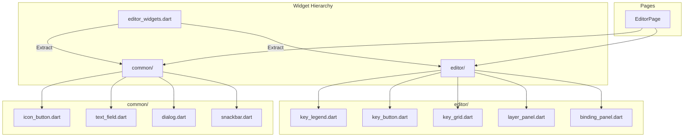

# Design Document

## Overview

This design extracts the monolithic `editor_widgets.dart` into a feature-based widget hierarchy. The core innovation is the `widgets/` directory structure that mirrors the page hierarchy, with a `common/` folder for shared components. Each widget file contains exactly one widget with its associated state and helper methods.

## Steering Document Alignment

### Technical Standards (tech.md)
- **Max 500 lines/file**: Each widget file < 300 lines
- **Single Responsibility**: One widget per file
- **Testability**: Widgets isolated for testing

### Project Structure (structure.md)
- Widgets in `ui/lib/widgets/`
- Feature subdirectories: `editor/`, `preview/`, `settings/`
- Shared widgets: `common/`

## Code Reuse Analysis

### Existing Components to Leverage
- **Theme Extensions**: Existing theme for styling
- **Provider**: State management already in use
- **GoRouter**: Navigation patterns

### Integration Points
- **Pages**: Import widgets from `widgets/` directory
- **Services**: Widgets access via Provider
- **State**: Shared state through ChangeNotifier

## Architecture



### Modular Design Principles
- **Single File Responsibility**: One widget class per file
- **Component Isolation**: Widgets don't import each other directly
- **Barrel Exports**: Index files for clean imports
- **Feature Cohesion**: Related widgets in same directory

## Components and Interfaces

### Component 1: KeyLegend Widget

- **Purpose:** Display key legend with color coding
- **Interfaces:**
  ```dart
  class KeyLegend extends StatelessWidget {
    const KeyLegend({
      super.key,
      required this.items,
      this.orientation = Axis.horizontal,
    });

    final List<LegendItem> items;
    final Axis orientation;
  }

  class LegendItem {
    final String label;
    final Color color;
    final IconData? icon;
  }
  ```
- **Dependencies:** Theme
- **Reuses:** Existing legend rendering logic

### Component 2: KeyButton Widget

- **Purpose:** Interactive key representation
- **Interfaces:**
  ```dart
  class KeyButton extends StatelessWidget {
    const KeyButton({
      super.key,
      required this.keyCode,
      required this.label,
      this.onTap,
      this.onLongPress,
      this.isSelected = false,
      this.isHighlighted = false,
      this.size = KeyButtonSize.medium,
    });

    final int keyCode;
    final String label;
    final VoidCallback? onTap;
    final VoidCallback? onLongPress;
    final bool isSelected;
    final bool isHighlighted;
    final KeyButtonSize size;
  }

  enum KeyButtonSize { small, medium, large }
  ```
- **Dependencies:** Theme, gestures
- **Reuses:** Key rendering from editor_widgets

### Component 3: KeyGrid Widget

- **Purpose:** Grid layout of keyboard keys
- **Interfaces:**
  ```dart
  class KeyGrid extends StatelessWidget {
    const KeyGrid({
      super.key,
      required this.layout,
      required this.onKeyTap,
      this.selectedKeys = const {},
      this.highlightedKeys = const {},
    });

    final KeyboardLayout layout;
    final void Function(int keyCode) onKeyTap;
    final Set<int> selectedKeys;
    final Set<int> highlightedKeys;
  }
  ```
- **Dependencies:** KeyButton
- **Reuses:** Grid layout logic

### Component 4: LayerPanel Widget

- **Purpose:** Layer selection and management
- **Interfaces:**
  ```dart
  class LayerPanel extends StatelessWidget {
    const LayerPanel({
      super.key,
      required this.layers,
      required this.activeLayer,
      required this.onLayerSelect,
      this.onLayerAdd,
      this.onLayerDelete,
    });

    final List<Layer> layers;
    final int activeLayer;
    final void Function(int) onLayerSelect;
    final VoidCallback? onLayerAdd;
    final void Function(int)? onLayerDelete;
  }
  ```
- **Dependencies:** Theme, layer models
- **Reuses:** Layer panel from editor_widgets

### Component 5: BindingPanel Widget

- **Purpose:** Key binding configuration
- **Interfaces:**
  ```dart
  class BindingPanel extends StatefulWidget {
    const BindingPanel({
      super.key,
      required this.binding,
      required this.onSave,
      this.onCancel,
    });

    final KeyBinding? binding;
    final void Function(KeyBinding) onSave;
    final VoidCallback? onCancel;
  }
  ```
- **Dependencies:** Form widgets, binding models
- **Reuses:** Binding form from editor_widgets

### Component 6: Barrel Exports

- **Purpose:** Clean import paths
- **Interfaces:**
  ```dart
  // widgets/editor/editor.dart
  export 'key_legend.dart';
  export 'key_button.dart';
  export 'key_grid.dart';
  export 'layer_panel.dart';
  export 'binding_panel.dart';

  // widgets/widgets.dart
  export 'common/common.dart';
  export 'editor/editor.dart';
  ```
- **Dependencies:** All widgets
- **Reuses:** Dart barrel export pattern

## Data Models

### KeyboardLayout
```dart
class KeyboardLayout {
  final String name;
  final List<KeyRow> rows;
  final double keySpacing;
}

class KeyRow {
  final List<KeyDefinition> keys;
  final double offsetX;
}
```

### LegendItem
```dart
class LegendItem {
  final String label;
  final Color color;
  final IconData? icon;
  final String? tooltip;
}
```

## Error Handling

### Error Scenarios

1. **Missing key definition**
   - **Handling:** Show placeholder widget
   - **User Impact:** Unknown key displayed gracefully

2. **Invalid layer reference**
   - **Handling:** Log warning, use default layer
   - **User Impact:** Seamless fallback

3. **Widget build failure**
   - **Handling:** ErrorWidget with message
   - **User Impact:** Clear error indication

## Testing Strategy

### Unit Testing
- Test each widget in isolation
- Mock dependencies
- Verify render output

### Widget Testing
- Test widget interactions
- Verify callbacks fire
- Test state changes

### Golden Testing
- Screenshot comparison for visual widgets
- Test different sizes and themes
- Verify accessibility
