# Technology Stack

## Project Type
Desktop application with a hybrid architecture: native Rust core engine communicating with a Flutter GUI via FFI bridge. The core can also run headless as a daemon.

## Core Technologies

### Primary Languages
- **Rust (stable)**: Core engine, event loop, scripting runtime, OS drivers
- **Dart/Flutter**: Cross-platform GUI application
- **Rhai**: Embedded scripting language for user configuration

### Runtime/Build Tools
- **Tokio**: Async runtime for concurrent event handling
- **Cargo**: Rust package manager and build system
- **Flutter SDK**: UI framework with hot reload

### Key Dependencies/Libraries

#### Rust Core
- **tokio**: Async runtime for event loop and concurrent I/O
- **rhai**: Embedded scripting engine (sandboxed, Rust-native)
- **proptest**: Property-based testing and fuzzing
- **criterion**: Latency benchmarking

#### Platform Drivers
- **windows-rs**: Windows API bindings for WH_KEYBOARD_LL hooks
- **evdev/uinput**: Linux input device handling

#### Flutter UI
- **dart:ffi**: Foreign Function Interface to Rust
- **Skia/Impeller**: Hardware-accelerated rendering

### Application Architecture

**3-Layer Hybrid Architecture**:

```
┌─────────────────────────────────────────┐
│           UI Layer (Flutter)            │
│  Visual Editor │ Debugger │ REPL        │
└────────────────┬────────────────────────┘
                 │ FFI (C-ABI)
┌────────────────┴────────────────────────┐
│           Core Layer (Rust)             │
│  Tokio Event Loop │ Rhai │ State Machine│
└────────────────┬────────────────────────┘
                 │ Trait Abstraction
┌────────────────┴────────────────────────┐
│           OS Layer (Native Adapters)    │
│  Windows Hook │ Linux uinput/evdev      │
└─────────────────────────────────────────┘
```

**Key Patterns**:
- **Event Sourcing**: Input treated as immutable event stream
- **No Global State**: All instances are self-contained structs
- **Modular Drivers**: OS adapters implement generic `InputSource` trait
- **Dependency Injection**: All external dependencies injected for testability
- **CLI First**: All features exercisable via CLI before GUI implementation

## Scripting Contract (Rhai)
- **Core functions**: `remap(from, to)`, `block(key)`, `pass(key)`, `print_debug(msg)`; later calls override earlier ones for the same key.
- **Hooks**: `on_init()` runs once to register remaps/blocks/passes; undefined hooks are ignored. Keep init fast and log via `print_debug`.
- **Defaults**: Keys pass through unless remapped/blocked; `pass()` clears prior remap/block.
- **Error handling**: Invalid key names throw; pattern: `try { remap(...) } catch { print_debug("reason") }` or helper-style `safe_remap`.
- **Sandbox limits**: Max expression depth 64; max operations 100,000 to prevent hangs.
- **Debugging**: `keyrx run --script <file> --debug` to view hook execution and remap registration.

## Key Naming & Aliases
- **Canonical source**: `core/src/drivers/keycodes/definitions.rs` defines `KeyCode` variants and aliases; names are case-insensitive.
- **Guideline**: Prefer canonical names (e.g., `CapsLock`, `LeftCtrl`, `MediaPlayPause`, `NumpadEnter`) in scripts for clarity; aliases (`caps`, `ctrl`, `playpause`, `kpenter`) are accepted.
- **Coverage**: Letters, numbers, F1–F12, modifiers, navigation, editing, locks, punctuation, numpad, and media keys. Unknown names raise runtime errors that point here.
- **Physical identity**: Drivers translate scan codes/OS codes into `KeyCode` + `InputEvent` metadata (`device_id`, `scan_code`, `is_synthetic`, `is_repeat`) before the engine. Position-style names like `KEY_0_0` can be layered on top for blank-canvas layouts.

## Device Discovery & Physical Key Mapping

### The Key Identity Problem

```
Physical Key Press
       │
       ▼
┌──────────────────────────────────────────────────────────────┐
│ Hardware Layer                                               │
│  Keyboard firmware → scan_code (e.g., 0x1E for 'A' position)│
└──────────────────────────────────────────────────────────────┘
       │
       ▼
┌──────────────────────────────────────────────────────────────┐
│ OS Layer                                                     │
│  Linux:   scan_code 0x1E → evdev KEY_A (30)                 │
│  Windows: scan_code 0x1E → VK_A (0x41)                      │
│  (OS applies keyboard layout, modifier state, etc.)         │
└──────────────────────────────────────────────────────────────┘
       │
       ▼
┌──────────────────────────────────────────────────────────────┐
│ KeyRx Layer (intercepts here)                               │
│  We receive: scan_code + OS code + metadata                 │
│  We can: use scan_code for true hardware identity           │
└──────────────────────────────────────────────────────────────┘
```



```mermaid
flowchart LR
    FW["Keyboard firmware\nscan_code (e.g., 0x1E)"] --> OS["OS translation\nLinux: evdev KEY_A (30)\nWindows: VK_A (0x41)"]
    OS --> DRV["KeyRx driver\nread device + metadata"]
    DRV --> EVT["Normalize InputEvent\nKeyCode + scan_code + device_id + flags"]
    EVT --> ENG["Engine\nTokio loop + layer state"]
    ENG --> RHAI["Rhai hooks\nremap/block/pass"]
    RHAI --> OUT["OutputAction\nKeyDown/Up/Tap/Block/PassThrough"]
    OUT --> INJ["Injector\nuinput/SendInput"]
    style EVT fill:#eef9ff,stroke:#5b8def
    style ENG fill:#eef9ff,stroke:#5b8def
    style RHAI fill:#eef9ff,stroke:#5b8def
```

### scan_code: The Universal Key Identifier

- `scan_code` is generated by keyboard firmware, same across OS
- Represents physical button position on keyboard matrix
- **This is our path to true blank canvas**

### Physical Key Registry Architecture

```rust
/// Physical key identity based on scan_code and discovery
pub struct PhysicalKey {
    /// Hardware scan code (universal across OS)
    pub scan_code: u16,
    /// Discovered physical position (row, column)
    pub position: (u8, u8),
    /// User-friendly alias (e.g., "KEY_2_1" or "LeftPinky")
    pub alias: String,
}

/// Per-device keyboard profile
pub struct DeviceProfile {
    /// Unique device identifier
    pub vendor_id: u16,
    pub product_id: u16,
    /// Human-readable name
    pub name: String,
    /// Physical layout dimensions
    pub rows: u8,
    pub cols_per_row: Vec<u8>,
    /// scan_code → PhysicalKey mapping
    pub keymap: HashMap<u16, PhysicalKey>,
    /// Discovery timestamp
    pub discovered_at: DateTime<Utc>,
}

/// Global device profile registry
pub struct DeviceRegistry {
    /// All known device profiles
    profiles: HashMap<(u16, u16), DeviceProfile>,
    /// Default fallback (uses OS key names)
    default_profile: DeviceProfile,
}
```

### Storage Layout

```
~/.config/keyrx/
├── devices/
│   ├── 046d_c52b.json       # Logitech keyboard
│   ├── 04d9_0169.json       # Generic USB keyboard
│   └── default.json         # Fallback profile
├── scripts/
│   └── user_config.rhai     # User's remapping script
└── config.toml              # Global settings
```

### Device Profile JSON Format

```json
{
  "vendor_id": "046d",
  "product_id": "c52b",
  "name": "Logitech K270",
  "discovered_at": "2025-11-30T12:00:00Z",
  "rows": 6,
  "cols_per_row": [14, 14, 14, 13, 12, 8],
  "keymap": {
    "1": { "position": [0, 0], "alias": "KEY_0_0" },
    "59": { "position": [0, 1], "alias": "KEY_0_1" },
    "30": { "position": [2, 1], "alias": "KEY_2_1" }
  }
}
```

### Dual-Mode Key Identification

KeyRx supports both traditional and physical key identification:

```rhai
// Mode 1: Traditional (OS key names) - for quick setup
remap("CapsLock", "Escape");

// Mode 2: Physical position - for true blank canvas
remap("KEY_3_0", "KEY_0_0");

// Mode 3: User aliases - for readability
alias("KEY_3_0", "LeftPinky");
alias("KEY_0_0", "TopLeft");
remap("LeftPinky", "TopLeft");

// Mode 4: Raw scan codes - for advanced users
remap_scan(0x3A, 0x01);  // CapsLock scan → Esc scan
```

### Modifier Keys as Pure Buttons

At the hardware level, modifier keys are identical to regular keys:

| Key | scan_code | OS Behavior | KeyRx Behavior |
|-----|-----------|-------------|----------------|
| Left Shift | 0x2A | Modifies other keys | Just `KEY_4_0` |
| Left Ctrl | 0x1D | Modifies other keys | Just `KEY_5_0` |
| Left Alt | 0x38 | Modifies other keys | Just `KEY_5_2` |

**Linux**: evdev gives raw events, we grab exclusively before OS processing
**Windows**: Hook intercepts before modifier state applied (mostly)

### Data Storage
- **Primary storage**: Rhai script files (user configurations)
- **Device profiles**: JSON files per (vendor_id, product_id)
- **Runtime state**: In-memory layer state machine
- **Data formats**: Rhai scripts (text), JSON for state/profiles

### External Integrations
- **Protocols**: OS-level keyboard hooks (WH_KEYBOARD_LL, evdev)
- **FFI**: Dart-Rust communication via C-compatible ABI

## Dependency Injection Architecture

All external dependencies are injected via traits, enabling testability and mock substitution:

```rust
// Trait definition (interface)
pub trait InputSource: Send + Sync {
    fn poll_events(&mut self) -> Vec<InputEvent>;
    fn send_output(&mut self, action: OutputAction) -> Result<()>;
}

pub trait ScriptRuntime: Send + Sync {
    fn execute(&mut self, script: &str) -> Result<ScriptResult>;
    fn call_hook(&mut self, hook: &str, args: &[Value]) -> Result<Value>;
}

pub trait StateStore: Send + Sync {
    fn get_layer(&self, name: &str) -> Option<&Layer>;
    fn set_active_modifiers(&mut self, mods: ModifierSet);
}

// Engine with injected dependencies
pub struct Engine<I: InputSource, S: ScriptRuntime, St: StateStore> {
    input: I,
    script: S,
    state: St,
}

// Production usage
let engine = Engine::new(
    WindowsInputSource::new()?,
    RhaiRuntime::new()?,
    InMemoryState::new(),
);

// Test usage with mocks
let engine = Engine::new(
    MockInputSource::new(),
    MockScriptRuntime::new(),
    MockState::new(),
);
```

## Advanced Remapping Engine Architecture

The engine implements a layered architecture for advanced keyboard customization. All timing parameters are configurable, enabling users to tune behavior for their typing style.

### Engine Layer Model

```
┌─────────────────────────────────────────────────────────────────┐
│ Layer 5: CONFIG PATTERNS (Rhai scripts - user presets)         │
│   Home Row Mods, Caps Word, Auto Shift, Application-Aware      │
├─────────────────────────────────────────────────────────────────┤
│ Layer 4: COMPOSED BEHAVIORS                                    │
│   ┌──────────────────────┐  ┌──────────────────────┐           │
│   │ Engine (perf critical)│  │ Script (flexibility) │           │
│   │ • Tap-Hold           │  │ • Tap-Dance          │           │
│   │ • One-Shot           │  │ • Leader Key         │           │
│   │ • Combos             │  │ • Layer modes        │           │
│   └──────────────────────┘  └──────────────────────┘           │
├─────────────────────────────────────────────────────────────────┤
│ Layer 3: ACTION PRIMITIVES (Engine - What to output)           │
│   emit_key, block, modifier_on/off, layer_push/pop, macro      │
├─────────────────────────────────────────────────────────────────┤
│ Layer 2: DECISION PRIMITIVES (Engine - When to act)            │
│   tap_or_hold, simultaneous, sequence, interrupt               │
├─────────────────────────────────────────────────────────────────┤
│ Layer 1: STATE MANAGEMENT (Engine - What we track)             │
│   key_states, timers, modifier_states, layer_stack             │
├─────────────────────────────────────────────────────────────────┤
│ Layer 0: EVENT METADATA (Driver - from REQ-9)                  │
│   timestamp_us, is_repeat, is_synthetic, scan_code, device_id  │
└─────────────────────────────────────────────────────────────────┘
```

### Configurable Timing Parameters

All timing decisions are parameterized, not hardcoded:

```rust
pub struct TimingConfig {
    /// Duration (ms) to distinguish tap from hold. Default: 200
    pub tap_timeout_ms: u32,

    /// Window (ms) for detecting simultaneous keypresses. Default: 50
    pub combo_timeout_ms: u32,

    /// Delay (ms) before considering a hold, to prevent misfires. Default: 0
    pub hold_delay_ms: u32,

    /// If true, emit tap immediately and correct if becomes hold. Default: false
    pub eager_tap: bool,

    /// If true, consider as hold if another key pressed during hold. Default: true
    pub permissive_hold: bool,

    /// If true, release tap even if interrupted (retro tap). Default: false
    pub retro_tap: bool,
}
```

### Virtual Modifiers

Up to 255 user-defined virtual modifiers exist only in the engine:

```rust
pub struct ModifierState {
    /// Bitmap for 255 custom modifiers (Mod1-Mod255)
    custom: [u64; 4],  // 256 bits

    /// Standard modifiers (Ctrl, Shift, Alt, Win)
    standard: StandardModifiers,
}

// In Rhai scripts:
// define_modifier("Mod_Thumb");
// on_key("Space", hold: activate_modifier("Mod_Thumb"));
// on_key("J", when: modifier_active("Mod_Thumb"), emit: "Left");
```

### Layer System

Layers are stacked with configurable priority:

```rust
pub struct LayerStack {
    /// Active layers in priority order (highest first)
    stack: Vec<LayerId>,

    /// Layer definitions with transparency support
    layers: HashMap<LayerId, Layer>,
}

pub struct Layer {
    pub name: String,
    pub mappings: HashMap<KeyCode, LayerAction>,
    pub transparent: bool,  // Fall through to layer below
}
```

### Decision State Machine

The engine tracks pending decisions for timing-based behaviors:

```rust
pub enum PendingDecision {
    TapOrHold {
        key: KeyCode,
        pressed_at: Instant,
        tap_action: Action,
        hold_action: Action,
    },
    Combo {
        keys: Vec<KeyCode>,
        started_at: Instant,
        combo_action: Action,
    },
    Sequence {
        keys_so_far: Vec<KeyCode>,
        started_at: Instant,
    },
}
```

### GUI Visualization Contract

The engine exposes state for GUI visualization:

```rust
pub struct EngineState {
    /// Current pending decisions (for timing visualization)
    pub pending: Vec<PendingDecision>,

    /// Active layers (for layer inspector)
    pub active_layers: Vec<LayerId>,

    /// Held modifiers (for modifier display)
    pub modifiers: ModifierState,

    /// Recent events with timing (for event log)
    pub event_history: VecDeque<TimedEvent>,

    /// Current config (for trade-off visualizer)
    pub timing_config: TimingConfig,
}
```

## CLI-First Development

Every feature must be CLI-exercisable before GUI implementation:

```bash
# Script validation and linting
keyrx check scripts/user_config.rhai

# Headless engine with debug output
keyrx run --debug --script scripts/user_config.rhai

# Event simulation (no real keyboard)
keyrx simulate --input "A,B,Ctrl+C" --expect "B,A,copy"

# State inspection
keyrx state --layers --modifiers --json

# Self-diagnostics
keyrx doctor --verbose

# Latency benchmarking
keyrx bench --iterations 10000

# REPL for interactive testing
keyrx repl
```

**Benefits**:
- **Rapid Trial**: Instant feedback without GUI overhead
- **Self-Check**: Automated validation in CI/CD pipelines
- **AI Agent Autonomy**: AI tools can test, validate, and iterate without human intervention
- **Debug Mode**: JSON output for programmatic parsing

## Development Environment

### Build & Development Tools
- **Build System**: Cargo (Rust), Flutter CLI
- **Package Management**: Cargo (crates.io), pub (pub.dev)
- **Development workflow**: Hot reload (Flutter), cargo watch (Rust)

### Code Quality Tools
- **Static Analysis**: clippy (Rust), dart analyze
- **Formatting**: rustfmt, dart format
- **Testing Framework**:
  - cargo test (unit tests)
  - proptest (property-based fuzzing)
  - criterion (benchmarks)
  - flutter_test (widget tests)
- **Documentation**: rustdoc, dartdoc

### Version Control & Collaboration
- **VCS**: Git
- **Branching Strategy**: Feature branches with PR reviews
- **Code Review Process**: PR-based with CI checks

## Deployment & Distribution
- **Target Platforms**: Windows 10+, Linux (X11/Wayland)
- **Distribution Method**: Binary releases, package managers (planned)
- **Installation Requirements**: No external runtime dependencies
- **Update Mechanism**: In-app update check (planned)

## Build System & Cross-Platform Compilation

### Build Targets Matrix

| Target | OS | Arch | Rust Target | Flutter | Status |
|--------|-----|------|-------------|---------|--------|
| Linux x64 | Ubuntu 20.04+ | x86_64 | `x86_64-unknown-linux-gnu` | linux-x64 | ✓ Primary |
| Linux ARM64 | Ubuntu 20.04+ | aarch64 | `aarch64-unknown-linux-gnu` | linux-arm64 | Planned |
| Windows x64 | Windows 10+ | x86_64 | `x86_64-pc-windows-msvc` | windows-x64 | ✓ Primary |
| Windows ARM64 | Windows 11+ | aarch64 | `aarch64-pc-windows-msvc` | windows-arm64 | Planned |

### Build Profiles

```toml
# Cargo.toml profiles
[profile.dev]
opt-level = 0
debug = true
incremental = true

[profile.release]
opt-level = 3
lto = "thin"
strip = true
panic = "abort"
codegen-units = 1

[profile.profiling]
inherits = "release"
debug = true
strip = false
```

### Feature Flags

```toml
[features]
default = ["linux"]
linux = ["evdev", "uinput"]
windows = ["windows-rs"]
tracing = ["opentelemetry", "opentelemetry-otlp"]
profiling = ["tracy-client"]
```

### Cross-Platform Build with cross-rs

```bash
# Install cross for cross-compilation
cargo install cross

# Build for Linux ARM64 from any host
cross build --release --target aarch64-unknown-linux-gnu

# Build for Windows from Linux
cross build --release --target x86_64-pc-windows-msvc
```

### Flutter Build Commands

```bash
# Linux release
flutter build linux --release

# Windows release
flutter build windows --release

# With specific Dart defines
flutter build linux --release --dart-define=SENTRY_DSN=$SENTRY_DSN
```

### Unified Build with Task Runner (just)

```just
# justfile - Modern command runner (https://just.systems)

# Default recipe
default: check

# === Development ===

# One-command dev setup
setup:
    rustup update stable
    cargo install cargo-watch cargo-nextest cross just
    cd ui && flutter pub get
    ./scripts/install-hooks.sh

# Watch mode for Rust development
dev:
    cd core && cargo watch -x 'clippy -- -D warnings' -x 'nextest run'

# Run Flutter with hot reload
ui:
    cd ui && flutter run -d linux

# === Quality ===

# Run all checks (CI-equivalent locally)
check: fmt clippy test

# Format all code
fmt:
    cd core && cargo fmt
    cd ui && dart format lib test

# Lint all code
clippy:
    cd core && cargo clippy --all-features -- -D warnings

# Run all tests
test:
    cd core && cargo nextest run --all-features
    cd ui && flutter test

# Run benchmarks
bench:
    cd core && cargo bench --bench latency

# === Build ===

# Build release binaries for current platform
build:
    cd core && cargo build --release
    cd ui && flutter build linux --release

# Build for all platforms (requires cross)
build-all: build-linux build-windows

build-linux:
    cd core && cargo build --release --target x86_64-unknown-linux-gnu

build-windows:
    cd core && cross build --release --target x86_64-pc-windows-msvc

# === Release ===

# Create release with changelog
release version:
    ./scripts/release.sh {{version}}

# Publish to GitHub Releases
publish version:
    gh release create v{{version}} \
        --title "v{{version}}" \
        --notes-file CHANGELOG.md \
        dist/*
```

## CI/CD Pipeline Architecture

### Pipeline Overview

```
┌─────────────────────────────────────────────────────────────────────────┐
│                         GitHub Actions Workflows                         │
├─────────────────────────────────────────────────────────────────────────┤
│                                                                          │
│  on: push/PR to main                                                     │
│  ┌──────────────────────────────────────────────────────────────────┐   │
│  │ ci.yml - Continuous Integration                                   │   │
│  │  ├─ check: fmt + clippy (Linux)                                  │   │
│  │  ├─ test-linux: cargo nextest (Ubuntu)                           │   │
│  │  ├─ test-windows: cargo nextest (Windows)                        │   │
│  │  ├─ test-flutter: flutter test (Linux)                           │   │
│  │  ├─ coverage: cargo llvm-cov → Codecov                           │   │
│  │  ├─ security: cargo audit + cargo deny                           │   │
│  │  └─ benchmark: criterion (on PR, compare with main)              │   │
│  └──────────────────────────────────────────────────────────────────┘   │
│                                                                          │
│  on: push tag v*                                                         │
│  ┌──────────────────────────────────────────────────────────────────┐   │
│  │ release.yml - Release Automation                                  │   │
│  │  ├─ build-linux-x64: cargo build --release                       │   │
│  │  ├─ build-linux-arm64: cross build (aarch64)                     │   │
│  │  ├─ build-windows-x64: cargo build --release                     │   │
│  │  ├─ build-flutter-linux: flutter build linux                     │   │
│  │  ├─ build-flutter-windows: flutter build windows                 │   │
│  │  ├─ package: create archives + checksums                         │   │
│  │  └─ publish: GitHub Release + artifacts                          │   │
│  └──────────────────────────────────────────────────────────────────┘   │
│                                                                          │
│  on: schedule (weekly)                                                   │
│  ┌──────────────────────────────────────────────────────────────────┐   │
│  │ maintenance.yml - Maintenance                                     │   │
│  │  ├─ dependencies: cargo update + PR                              │   │
│  │  ├─ security-audit: cargo audit (notify on vulnerabilities)      │   │
│  │  └─ stale: close stale issues/PRs                                │   │
│  └──────────────────────────────────────────────────────────────────┘   │
│                                                                          │
└─────────────────────────────────────────────────────────────────────────┘
```

### CI Workflow (ci.yml)

```yaml
name: CI

on:
  push:
    branches: [main]
  pull_request:

concurrency:
  group: ${{ github.workflow }}-${{ github.ref }}
  cancel-in-progress: true

env:
  CARGO_TERM_COLOR: always
  RUST_BACKTRACE: 1

jobs:
  # Fast checks first (fail fast)
  check:
    name: Check (fmt + clippy)
    runs-on: ubuntu-latest
    steps:
      - uses: actions/checkout@v4
      - uses: dtolnay/rust-toolchain@stable
        with:
          components: rustfmt, clippy
      - uses: Swatinem/rust-cache@v2
        with:
          workspaces: core -> target
      - name: Check formatting
        run: cargo fmt --check
        working-directory: ./core
      - name: Clippy
        run: cargo clippy --all-features -- -D warnings
        working-directory: ./core

  # Test matrix
  test:
    name: Test (${{ matrix.os }})
    needs: check
    strategy:
      fail-fast: false
      matrix:
        os: [ubuntu-latest, windows-latest]
    runs-on: ${{ matrix.os }}
    steps:
      - uses: actions/checkout@v4
      - uses: dtolnay/rust-toolchain@stable
      - uses: Swatinem/rust-cache@v2
        with:
          workspaces: core -> target
      - uses: taiki-e/install-action@nextest
      - name: Run tests
        run: cargo nextest run --all-features --profile ci
        working-directory: ./core

  # Flutter tests
  test-flutter:
    name: Test Flutter
    needs: check
    runs-on: ubuntu-latest
    steps:
      - uses: actions/checkout@v4
      - uses: subosito/flutter-action@v2
        with:
          flutter-version: '3.24.0'
          channel: 'stable'
          cache: true
      - name: Install dependencies
        run: flutter pub get
        working-directory: ./ui
      - name: Analyze
        run: flutter analyze
        working-directory: ./ui
      - name: Run tests
        run: flutter test --coverage
        working-directory: ./ui

  # Code coverage
  coverage:
    name: Coverage
    needs: check
    runs-on: ubuntu-latest
    steps:
      - uses: actions/checkout@v4
      - uses: dtolnay/rust-toolchain@stable
        with:
          components: llvm-tools-preview
      - uses: Swatinem/rust-cache@v2
        with:
          workspaces: core -> target
      - uses: taiki-e/install-action@cargo-llvm-cov
      - name: Generate coverage
        run: cargo llvm-cov --all-features --lcov --output-path lcov.info
        working-directory: ./core
      - uses: codecov/codecov-action@v4
        with:
          files: ./core/lcov.info
          fail_ci_if_error: true
          token: ${{ secrets.CODECOV_TOKEN }}

  # Security audit
  security:
    name: Security Audit
    runs-on: ubuntu-latest
    steps:
      - uses: actions/checkout@v4
      - uses: rustsec/audit-check@v2
        with:
          working-directory: ./core
          token: ${{ secrets.GITHUB_TOKEN }}

  # Benchmark regression check (PRs only)
  benchmark:
    name: Benchmark
    if: github.event_name == 'pull_request'
    needs: check
    runs-on: ubuntu-latest
    steps:
      - uses: actions/checkout@v4
      - uses: dtolnay/rust-toolchain@stable
      - uses: Swatinem/rust-cache@v2
        with:
          workspaces: core -> target
      - name: Run benchmarks
        run: cargo bench --bench latency -- --save-baseline pr-${{ github.event.number }}
        working-directory: ./core
      - name: Compare with main
        run: |
          cargo bench --bench latency -- --baseline main --save-baseline pr-${{ github.event.number }} 2>&1 | tee bench-result.txt
          if grep -q "regressed" bench-result.txt; then
            echo "::warning::Performance regression detected"
          fi
        working-directory: ./core
      - uses: actions/upload-artifact@v4
        with:
          name: benchmark-results
          path: core/target/criterion
```

### Release Workflow (release.yml)

```yaml
name: Release

on:
  push:
    tags:
      - 'v*'

permissions:
  contents: write

jobs:
  build:
    name: Build (${{ matrix.target }})
    strategy:
      matrix:
        include:
          - target: x86_64-unknown-linux-gnu
            os: ubuntu-latest
            name: linux-x64
          - target: x86_64-pc-windows-msvc
            os: windows-latest
            name: windows-x64
    runs-on: ${{ matrix.os }}
    steps:
      - uses: actions/checkout@v4
      - uses: dtolnay/rust-toolchain@stable
        with:
          targets: ${{ matrix.target }}
      - uses: Swatinem/rust-cache@v2
        with:
          workspaces: core -> target

      - name: Build Rust core
        run: cargo build --release --target ${{ matrix.target }}
        working-directory: ./core

      - name: Setup Flutter
        uses: subosito/flutter-action@v2
        with:
          flutter-version: '3.24.0'
          channel: 'stable'
          cache: true

      - name: Build Flutter (Linux)
        if: matrix.os == 'ubuntu-latest'
        run: |
          sudo apt-get update
          sudo apt-get install -y ninja-build libgtk-3-dev
          flutter pub get
          flutter build linux --release
        working-directory: ./ui

      - name: Build Flutter (Windows)
        if: matrix.os == 'windows-latest'
        run: |
          flutter pub get
          flutter build windows --release
        working-directory: ./ui

      - name: Package (Linux)
        if: matrix.os == 'ubuntu-latest'
        run: |
          mkdir -p dist
          tar -czvf dist/keyrx-${{ github.ref_name }}-${{ matrix.name }}.tar.gz \
            -C core/target/${{ matrix.target }}/release keyrx \
            -C ../../ui/build/linux/x64/release/bundle .
          sha256sum dist/*.tar.gz > dist/checksums-${{ matrix.name }}.txt

      - name: Package (Windows)
        if: matrix.os == 'windows-latest'
        run: |
          mkdir dist
          Compress-Archive -Path core/target/${{ matrix.target }}/release/keyrx.exe, ui/build/windows/x64/runner/Release/* -DestinationPath dist/keyrx-${{ github.ref_name }}-${{ matrix.name }}.zip
          Get-FileHash dist/*.zip | Format-Table -Property Hash, Path > dist/checksums-${{ matrix.name }}.txt

      - uses: actions/upload-artifact@v4
        with:
          name: release-${{ matrix.name }}
          path: dist/*

  publish:
    name: Publish Release
    needs: build
    runs-on: ubuntu-latest
    steps:
      - uses: actions/checkout@v4
      - uses: actions/download-artifact@v4
        with:
          path: artifacts
          pattern: release-*
          merge-multiple: true

      - name: Generate changelog
        id: changelog
        run: |
          # Extract changelog for this version
          VERSION=${{ github.ref_name }}
          echo "Generating changelog for $VERSION"
          # Use git-cliff or manual extraction
          git log $(git describe --tags --abbrev=0 HEAD^)..HEAD --pretty=format:"- %s" > RELEASE_NOTES.md

      - name: Create GitHub Release
        uses: softprops/action-gh-release@v2
        with:
          files: artifacts/*
          body_path: RELEASE_NOTES.md
          draft: false
          prerelease: ${{ contains(github.ref_name, '-') }}
          generate_release_notes: true
```

### Maintenance Workflow (maintenance.yml)

```yaml
name: Maintenance

on:
  schedule:
    - cron: '0 0 * * 0'  # Weekly on Sunday
  workflow_dispatch:

jobs:
  update-dependencies:
    name: Update Dependencies
    runs-on: ubuntu-latest
    steps:
      - uses: actions/checkout@v4
      - uses: dtolnay/rust-toolchain@stable
      - name: Update Cargo dependencies
        run: cargo update
        working-directory: ./core
      - name: Create PR
        uses: peter-evans/create-pull-request@v6
        with:
          commit-message: 'chore(deps): weekly dependency update'
          title: 'chore(deps): Weekly dependency update'
          branch: deps/weekly-update
          delete-branch: true

  security-audit:
    name: Security Audit
    runs-on: ubuntu-latest
    steps:
      - uses: actions/checkout@v4
      - uses: rustsec/audit-check@v2
        with:
          working-directory: ./core
          token: ${{ secrets.GITHUB_TOKEN }}
```

## Release Management

### Versioning Strategy

**Semantic Versioning (SemVer)**: `MAJOR.MINOR.PATCH[-PRERELEASE]`

| Component | When to Increment |
|-----------|------------------|
| MAJOR | Breaking changes to Rhai API, FFI contract, or config format |
| MINOR | New features, new Rhai functions, non-breaking additions |
| PATCH | Bug fixes, performance improvements, documentation |
| PRERELEASE | Alpha (`-alpha.1`), Beta (`-beta.1`), RC (`-rc.1`) |

### Release Checklist

```markdown
## Release v{VERSION} Checklist

### Pre-Release
- [ ] All CI checks passing on main
- [ ] CHANGELOG.md updated with release notes
- [ ] Version bumped in: Cargo.toml, pubspec.yaml
- [ ] Documentation updated for new features
- [ ] Breaking changes documented in migration guide

### Release
- [ ] Create annotated tag: `git tag -a v{VERSION} -m "Release v{VERSION}"`
- [ ] Push tag: `git push origin v{VERSION}`
- [ ] Verify GitHub Actions release workflow completes
- [ ] Verify artifacts uploaded to GitHub Release

### Post-Release
- [ ] Announce on relevant channels
- [ ] Update version in main to next dev version
- [ ] Close milestone in GitHub
```

### Changelog Format (Keep a Changelog)

```markdown
# Changelog

All notable changes to this project will be documented in this file.

The format is based on [Keep a Changelog](https://keepachangelog.com/en/1.1.0/),
and this project adheres to [Semantic Versioning](https://semver.org/spec/v2.0.0.html).

## [Unreleased]

### Added
- New feature description

### Changed
- Changed behavior description

### Deprecated
- Deprecated feature

### Removed
- Removed feature

### Fixed
- Bug fix description

### Security
- Security fix description

## [1.0.0] - 2025-01-15

### Added
- Initial release with core remapping engine
- Rhai scripting support
- Windows and Linux drivers
- Flutter GUI with debugger, training, trade-off visualizer
```

### Automated Changelog with git-cliff

```toml
# cliff.toml
[changelog]
header = """
# Changelog\n
"""
body = """

### {{ group | upper_first }}

- {{ commit.message | upper_first }}\


"""
trim = true

[git]
conventional_commits = true
filter_unconventional = true
commit_parsers = [
    { message = "^feat", group = "Added" },
    { message = "^fix", group = "Fixed" },
    { message = "^perf", group = "Performance" },
    { message = "^refactor", group = "Changed" },
    { message = "^doc", group = "Documentation" },
    { message = "^chore\\(deps\\)", group = "Dependencies" },
]
```

## Developer Experience & Tooling

### One-Command Setup

```bash
# Clone and setup in one command
git clone https://github.com/user/keyrx.git && cd keyrx && just setup
```

### Pre-commit Hooks

```bash
#!/bin/bash
# .git/hooks/pre-commit (installed by install-hooks.sh)

echo "Running pre-commit checks..."

# Format check
echo "  Checking formatting..."
(cd core && cargo fmt --check) || { echo "  ✗ Run 'cargo fmt'"; exit 1; }
echo "  ✓ Formatting OK"

# Clippy
echo "  Running clippy..."
(cd core && cargo clippy -- -D warnings) || { echo "  ✗ Clippy failed"; exit 1; }
echo "  ✓ Clippy OK"

# Tests
echo "  Running unit tests..."
(cd core && cargo test --lib) || { echo "  ✗ Tests failed"; exit 1; }
echo "  ✓ Tests OK"

echo "✅ All pre-commit checks passed!"
```

### IDE Configuration

**VS Code Settings (.vscode/settings.json)**:
```json
{
  "rust-analyzer.cargo.features": "all",
  "rust-analyzer.check.command": "clippy",
  "rust-analyzer.check.extraArgs": ["--", "-D", "warnings"],
  "editor.formatOnSave": true,
  "[rust]": {
    "editor.defaultFormatter": "rust-lang.rust-analyzer"
  },
  "[dart]": {
    "editor.defaultFormatter": "Dart-Code.dart-code"
  },
  "dart.flutterSdkPath": ".fvm/flutter_sdk"
}
```

**VS Code Extensions (.vscode/extensions.json)**:
```json
{
  "recommendations": [
    "rust-lang.rust-analyzer",
    "tamasfe.even-better-toml",
    "serayuzgur.crates",
    "Dart-Code.flutter",
    "Dart-Code.dart-code",
    "streetsidesoftware.code-spell-checker"
  ]
}
```

### Debug Configurations (.vscode/launch.json)

```json
{
  "version": "0.2.0",
  "configurations": [
    {
      "type": "lldb",
      "request": "launch",
      "name": "Debug keyrx run",
      "cargo": {
        "args": ["build", "--bin=keyrx", "--package=keyrx_core"],
        "filter": { "kind": "bin" }
      },
      "args": ["run", "--script", "scripts/example_config.rhai", "--debug"],
      "cwd": "${workspaceFolder}/core"
    },
    {
      "type": "lldb",
      "request": "launch",
      "name": "Debug Tests",
      "cargo": {
        "args": ["test", "--no-run", "--lib"],
        "filter": { "kind": "lib" }
      },
      "cwd": "${workspaceFolder}/core"
    },
    {
      "name": "Flutter",
      "type": "dart",
      "request": "launch",
      "program": "lib/main.dart",
      "cwd": "${workspaceFolder}/ui"
    }
  ]
}
```

### Development Container (devcontainer.json)

```json
{
  "name": "KeyRx Development",
  "image": "mcr.microsoft.com/devcontainers/rust:1-bookworm",
  "features": {
    "ghcr.io/devcontainers/features/rust:1": {
      "version": "stable",
      "profile": "default"
    },
    "ghcr.io/aspect-build/aspect-workflows-images/features/just:1": {}
  },
  "postCreateCommand": "just setup",
  "customizations": {
    "vscode": {
      "extensions": [
        "rust-lang.rust-analyzer",
        "tamasfe.even-better-toml",
        "Dart-Code.flutter"
      ]
    }
  },
  "forwardPorts": [8080],
  "remoteUser": "vscode"
}
```

### Recommended Developer Tools

| Tool | Purpose | Install |
|------|---------|---------|
| `just` | Task runner (modern Make) | `cargo install just` |
| `cargo-nextest` | Fast test runner | `cargo install cargo-nextest` |
| `cargo-watch` | File watcher | `cargo install cargo-watch` |
| `cargo-llvm-cov` | Code coverage | `cargo install cargo-llvm-cov` |
| `cargo-audit` | Security audit | `cargo install cargo-audit` |
| `cargo-deny` | Dependency linting | `cargo install cargo-deny` |
| `cross` | Cross-compilation | `cargo install cross` |
| `git-cliff` | Changelog generator | `cargo install git-cliff` |
| `fvm` | Flutter version manager | `dart pub global activate fvm` |

## Technical Requirements & Constraints

### Performance Requirements
- **Input latency**: < 1ms processing overhead (hard requirement)
- **Memory usage**: < 50MB idle
- **Startup time**: < 500ms to fully operational
- **Benchmark threshold**: CI fails if latency increases > 100 microseconds

### Compatibility Requirements
- **Platform Support**: Windows 10+, Linux (kernel 5.0+)
- **Architecture**: x86_64, ARM64 (planned)
- **Standards Compliance**: HID specification compliance

### Security & Compliance
- **Script Sandboxing**: Rhai scripts cannot access filesystem, network, or system calls
- **No Elevated Privileges**: Runs in user space where possible
- **Safe Script Sharing**: Community scripts are inherently safe due to sandbox

### Scalability & Reliability
- **Reliability Target**: Zero crashes under any input sequence
- **Fuzz Testing**: Must survive 100,000+ random key combinations
- **Deterministic Replay**: Event sourcing enables bug reproduction

## Technical Decisions & Rationale

### Decision Log

1. **Rust over C++**: Chosen for memory safety, fearless concurrency, and modern tooling. Eliminates entire classes of bugs (use-after-free, data races) common in input handling.

2. **Rhai over Lua/Python**: Rhai compiles into Rust binary (no external VM), provides sandboxed safety by default, and shares types with Rust reducing conversion overhead.

3. **Flutter over Electron/Tauri**:
   - Hot reload for rapid UI iteration
   - Skia/Impeller provides 60fps+ rendering
   - Direct FFI to Rust (no HTTP/JSON serialization overhead)

4. **Tokio Async Runtime**: Input handling is inherently async. Enables concurrent handling of keyboard, mouse, MIDI, and timers without complex threading.

5. **Event Sourcing Pattern**: Enables "Replay Debugging" - record sessions to reproduce flaky bugs deterministically.

6. **Trait-based OS Abstraction**: Core logic never imports OS headers directly. Drivers are plugins implementing `InputSource` trait, enabling mock testing.

## Observability & Debuggability Architecture

Industry-standard observability infrastructure serving both AI coding agents and human developers.

### Design Goals

| Audience | Primary Needs |
|----------|---------------|
| **AI Agents** | Machine-parseable output, deterministic replay, self-verification, rapid iteration |
| **Humans** | Visual timing diagrams, state flow animation, real-time overlay, historical playback |

### Build Mode Behavior

| Feature | Debug Build | Release Build |
|---------|-------------|---------------|
| Session Recording | All sessions (auto) | Opt-in (`--record`) |
| Debug Overlay | Available | Hidden |
| Trace Level | TRACE | INFO |
| Assertions | Enabled | Disabled |
| Performance Checks | Enabled | Disabled |

### Event Log Infrastructure

```rust
/// Complete event record for replay and analysis
#[derive(Serialize, Deserialize)]
pub struct EventRecord {
    /// Monotonic sequence number
    pub seq: u64,
    /// Microseconds since session start
    pub timestamp_us: u64,
    /// The input event with all metadata
    pub input: InputEvent,
    /// Processing span ID (for tracing correlation)
    pub span_id: String,
    /// Decision made (if any)
    pub decision: Option<Decision>,
    /// Output actions produced
    pub outputs: Vec<OutputAction>,
    /// State snapshot (optional, for keyframes)
    pub state_snapshot: Option<EngineState>,
}
```

**Storage Configuration:**
- Retention: Configurable by hours (default: 24h debug, 1h release)
- Rolling update: Oldest sessions pruned automatically
- Format: JSON for interchange, CBOR/MessagePack for high-frequency timing data

### Tracing & OpenTelemetry

```rust
// Span hierarchy for each event
#[tracing::instrument(skip(self), fields(key = %event.key, seq = %event.seq))]
fn process_event(&mut self, event: InputEvent) -> Vec<OutputAction> {
    let _decision_span = tracing::info_span!("decision").entered();
    // Decision logic...

    let _output_span = tracing::info_span!("output").entered();
    // Output generation...
}
```

**Integration:**
- `tracing` crate for structured spans
- `tracing-opentelemetry` for OTLP export
- Compatible with Jaeger, Grafana, Datadog

### For AI Agents: Self-Verification

```bash
# Structured JSON output for parsing
keyrx simulate --input "CapsLock:tap" --json

# Deterministic replay with assertions
keyrx replay session.krx --assert-output expected.json

# Watch mode for rapid iteration
keyrx watch --script config.rhai --on-change "keyrx test"

# Semantic exit codes
# 0=success, 1=error, 2=assertion fail, 3=timeout
```

**Invariant Checks (debug build):**
- State consistency after each event
- Modifier state matches key state
- Layer stack integrity
- No orphaned pending decisions

### For Humans: Visual Feedback (Flutter GUI)

**Timing Diagram:**
```
Time (ms)  0    50   100  150  200  250
Key A      ████████████████░░░░░░░░░░░  (held)
Decision   │ pending... │ → HOLD      │
Threshold  │──── tap ───│─── hold ────│
                     200ms
```

**State Flow Visualization:**
- Event → Decision → Output trace
- Layer stack with transparency
- Active modifiers (custom + standard)
- Animated state transitions

**Real-time Debug Overlay (developer only):**
- Floating always-on-top panel
- Key heatmap, pending queue, latency display

### Performance Metrics

| Metric | Description |
|--------|-------------|
| `keyrx.event.latency_us` | Per-event processing time |
| `keyrx.decision.pending_count` | Undecided tap-holds |
| `keyrx.layer.active_count` | Active layer count |
| `keyrx.event.throughput` | Events per second |

### CLI Commands

```bash
# Record session (debug: auto, release: explicit)
keyrx run --record session.krx --script config.rhai

# Replay for debugging
keyrx replay session.krx --step-through

# Export to OTLP endpoint
keyrx run --otlp-endpoint http://localhost:4317

# Generate timing diagram
keyrx analyze session.krx --timing-diagram --output diagram.svg

# State inspection
keyrx state --json --include-pending --include-history
```

## Known Limitations

- **macOS Support**: Not currently targeted (different input architecture)
- **Wayland**: Limited support due to security model restrictions
- **32-bit Systems**: Not supported
- **Real-time Guarantees**: Best-effort low latency, not hard real-time
