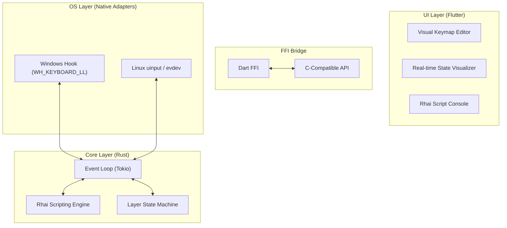

# KeyRx Architecture Manifesto

## 1. The "Greenfield" Vision

We are not porting Yamy. We are building the ultimate input engine from first principles.

### The 3-Layer Hybrid Architecture



## 2. The Core Engine (Rust)

### Async-First
The engine is an async `tokio` runtime.
*   **Input Stream:** Key presses come in via a `mpsc::channel`.
*   **Processing:** The engine runs the event through the active Rhai script hooks.
*   **Output Stream:** Resulting actions are sent to the OS adapter.

### Scripting (Rhai)
We do not use static config files. We use **Script Modules**.

```rust
// user_config.rhai

// Import the standard library
import "std/layouts/109" as jp109;
import "std/layers" as layers;

// Define a new 'Gaming' layer
let gaming = layers.new("Gaming");

// Define logic: Swap CapsLock and Ctrl
fn init() {
    input.remap(jp109.CapsLock, jp109.LeftCtrl);
    input.remap(jp109.LeftCtrl, jp109.CapsLock);
}

// Define logic: If 'Vim' is active, activate 'Edit' layer
fn on_window_change(app_name) {
    if app_name == "gvim.exe" {
        layers.activate("Edit");
    } else {
        layers.deactivate("Edit");
    }
}
```

## 3. The UI (Flutter)

The UI is not just a config generator. It is a **Window into the Brain**.

*   **Live View:** See exactly which layer is active, which modifiers are held, and why a key was blocked.
*   **Visual Wiring:** Drag-and-drop keys to rebind them, which generates the underlying Rhai script.
*   **Repl:** A terminal to type Rhai commands directly into the running engine for testing.

## 4. Testing Strategy

*   **Unit:** Rust tests for the logic engine.
*   **Integration:** Virtual input devices to test OS adapters.
*   **Property-Based:** Fuzz testing with `proptest` to ensure the engine never panics on weird key combos.
