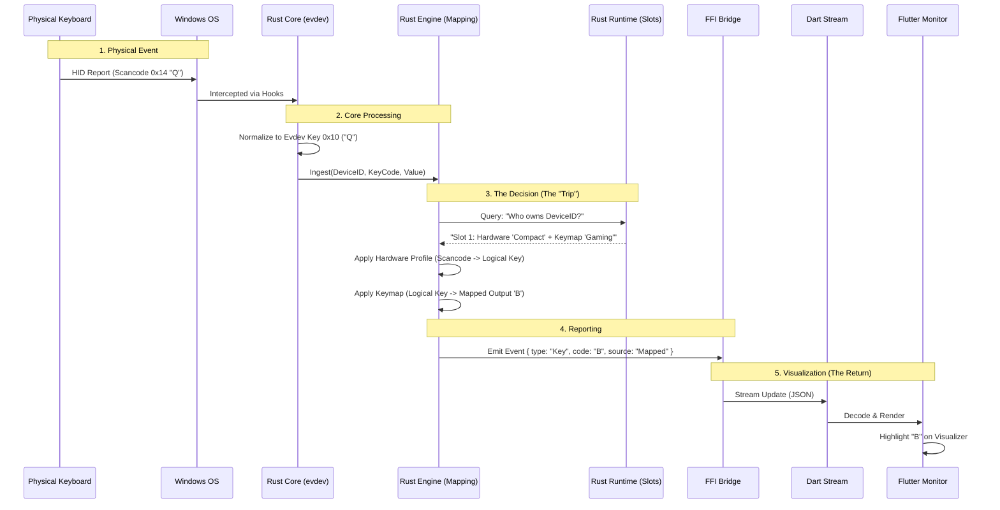

# Architecture: Long Trip from Key to Monitor

This document traces the complete journey of a key press event, from the physical hardware interrupt to the pixel changing on your screen in the Flutter Dashboard.

## The Concept

The core philosophy of KeyRx is: **"The Engine matches Hardware to Software via Slots."**

*   **Hardware**: Physical Reality (Scancodes).
*   **Software**: Logic (Rhia Scripts/Keymaps).
*   **Slots**: The Bridge (Wiring).

## The Journey



## Detailed Flow Analysis

### 1. Physical Input (The Source)
*   **Mechanism**: Windows `SetWindowsHookEx` (LL) or `RawInput`.
*   **Identity**: The keystroke comes tagged with a Device Handle.
*   **Resolution**: Rust converts this Handle to a `DeviceInstanceId` (VID:PID:Serial).

### 2. The Slot Lookup (The "Wiring")
This is where the magic (or the bug) happens. The Engine asks the `RuntimeConfig`:
*   *Input*: `DeviceInstanceId` ("My Keyboard")
*   *Question*: "What active slots do I have?"
*   *Expected Answer*: "You have Slot #1 active."

**Critical Data Integrity**:
*   If `RuntimeConfig` has a malformed Slot ID, or if the `DeviceInstanceId` doesn't match exactly (e.g. Serial mismatch), the Engine returns **No Slots**.
*   **Fallback**: If No Slots found, the Engine defaults to **Passthrough** (Original Key).

### 3. The Transformation
If a Slot is found:
1.  **Hardware Profile**: Translates Physical Scancode (e.g., location 16) to Logical ID (e.g., "Left Shift").
2.  **Keymap/Script**: Translates Logical ID to Output (e.g., "Meta + C").

### 4. The Loopback (Monitor)
The data displayed in the "Monitor" tab is the **Output** of the engine.
*   It does *not* show raw input (unless passthrough occurred).
*   If you see "Q" instead of "B", it means the Engine performed "Passthrough".
*   **Why Passthrough?** Because Step 2 (Slot Lookup) likely failed.

## Failure Diagnosis Checklist

If you see Raw Input ("Q") instead of Mapped Input ("B"), one of these links is broken:

1.  **Identity Mismatch**: Rust sees `Serial: A`, Config has `Serial: B`.
2.  **Slot Inactive**: The slot exists but `active: false`.
3.  **Malformed Config**: The slot data looks valid to JSON but nonsense to logic (e.g., `keymap_id: "default"` when you meant `"gaming_layer"`).

### Case Study: The "Double-Encoded" Bug
In your current `runtime.json`, we see:
```json
"id": "{\"id\":\"...\",\"keymap_id\":\"real_map\"...}",
"keymap_id": "default"
```
The Engine reads `keymap_id` -> "default".
"Default" maps to Empty/Passthrough.
Result: **Q -> Q**.

The "Real" keymap ID ("real_map") is trapping inside the `id` string, invisible to the Engine.
