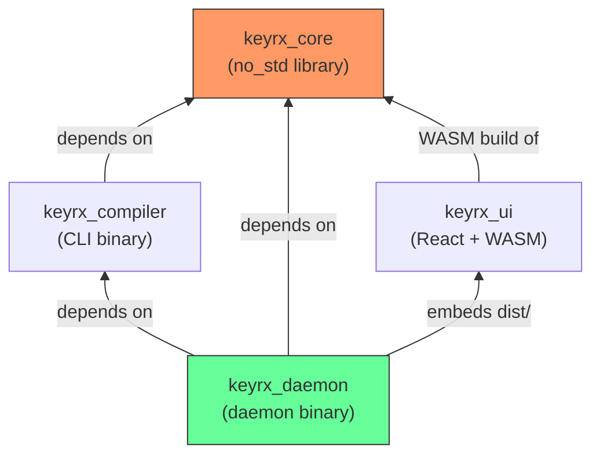
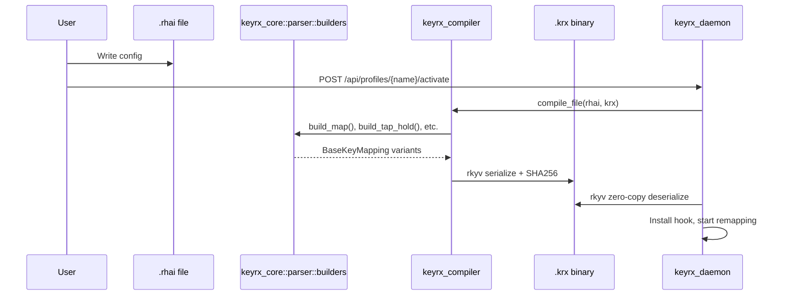
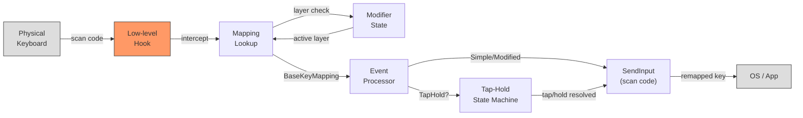
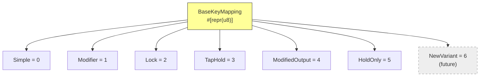
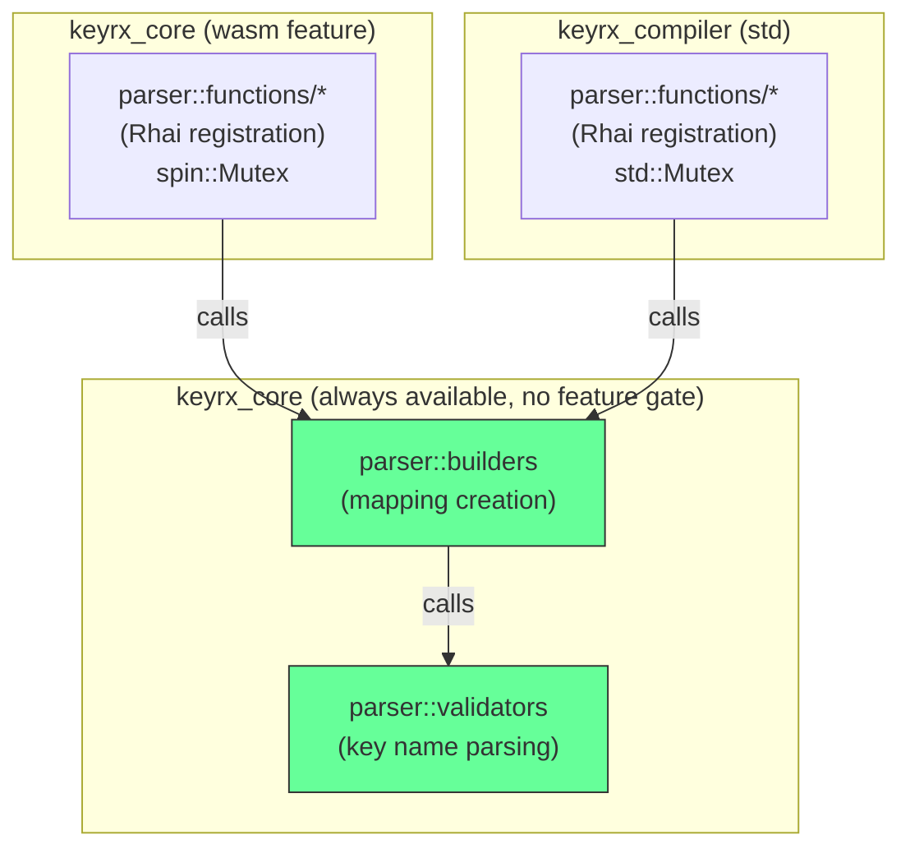
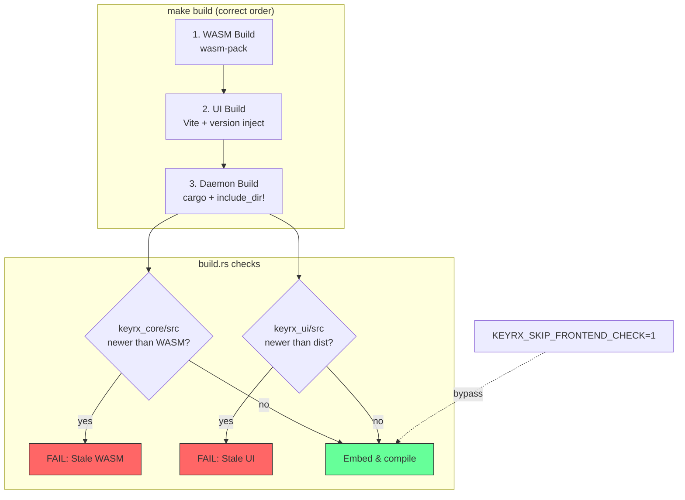
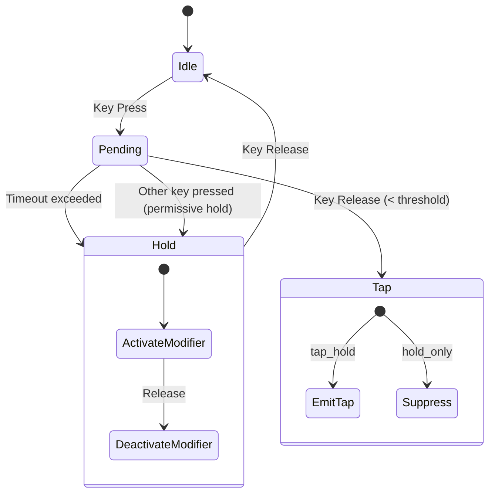
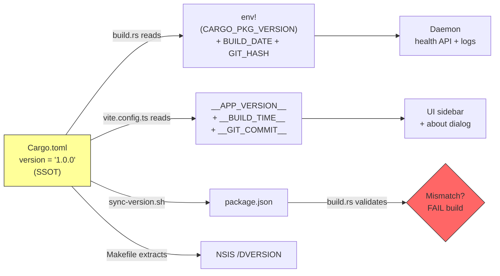

# KeyRx System Design

## Crate Dependency Graph

- **keyrx_core**: no_std library, shared by all consumers
- **keyrx_compiler**: used by keyrx_daemon for runtime profile compilation
- **keyrx_daemon**: embeds keyrx_ui dist/ at compile time via `include_dir!`
- **keyrx_ui**: compiled to WASM from keyrx_core for browser-side simulation

## Configuration Pipeline

## Key Event Flow (Windows)

## Binary Format Stability

Each variant has an **explicit discriminant value** (`= N`). Source ordering is irrelevant to binary format. New variants get the next unused ID. Enforced by `test_base_key_mapping_discriminant_stability`.

## Parser SSOT Architecture

Both parsers exist because keyrx_core uses `spin::Mutex` (no_std) and keyrx_compiler uses `std::Mutex`. The **validation and mapping creation logic** lives in shared `builders` module — only the Rhai engine registration is duplicated.

## Build Pipeline & Staleness Enforcement

## Tap-Hold & Hold-Only State Machine

- **tap_hold**: tap emits configured key, hold activates modifier layer
- **hold_only**: tap does nothing (suppressed), hold activates modifier layer

## Version Flow

No intermediate generated files. Version is injected at build time directly from Cargo.toml.
