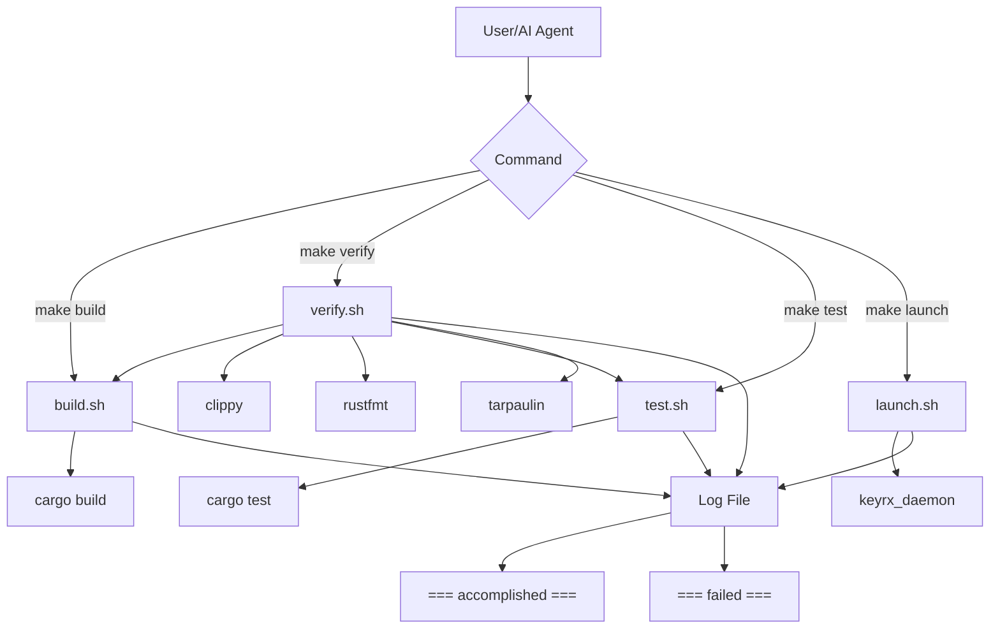

# Design Document

## Overview

The **AI-Dev-Foundation** establishes the critical infrastructure enabling fully autonomous AI-driven development of the keyrx project. This foundation consists of:

1. **4-Crate Workspace Structure**: Properly initialized Rust workspace with keyrx_core, keyrx_compiler, keyrx_daemon, keyrx_ui
2. **AI-Friendly Build Scripts**: Consistent, parseable scripts (build.sh, verify.sh, test.sh, launch.sh) with machine-readable output
3. **CLAUDE.md Documentation**: Single source of truth for AI agent guidance
4. **Quality Automation**: Pre-commit hooks and CI/CD for deterministic verification
5. **Simplified Orchestration**: Makefile for top-level commands

This foundation is the **prerequisite for all feature development**, as it creates an environment where AI agents can autonomously implement, test, and verify work without human intervention.

## Steering Document Alignment

### Technical Standards (tech.md)

**4-Crate Workspace Architecture**:
- `keyrx_core`: no_std library with rkyv, boomphf, fixedbitset, arrayvec
- `keyrx_compiler`: Binary with Rhai, serde, clap for CLI
- `keyrx_daemon`: Binary with platform-specific features (linux/windows/web)
- `keyrx_ui`: React 18+ with TypeScript 5+, Vite, WASM integration

**AI-Coding-Agent-Friendly Scripts**:
- Consistent markers: `=== accomplished ===`, `=== failed ===`, `=== warning ===`
- Epoch-timestamped logs: `scripts/logs/build_$(date +%s).log`
- Machine-parseable JSON output with `--json` flag
- Error-focused debugging with `--error` flag

**Quality Standards**:
- Pre-commit hooks enforce clippy (warnings as errors), rustfmt, tests
- CI/CD verifies 80% minimum test coverage (cargo-tarpaulin)
- Max 500 lines/file, max 50 lines/function (enforced via clippy)

### Project Structure (structure.md)

**Directory Organization**:
```
keyrx2/
├── keyrx_core/           # Core library (no_std)
├── keyrx_compiler/       # Compiler binary
├── keyrx_daemon/         # Daemon binary with web server
├── keyrx_ui/             # React frontend
├── scripts/              # Build/test/launch automation
│   ├── build.sh
│   ├── verify.sh
│   ├── test.sh
│   ├── launch.sh
│   ├── setup_hooks.sh
│   ├── logs/             # Timestamped execution logs
│   └── CLAUDE.md         # Script documentation
├── .claude/
│   └── CLAUDE.md         # AI agent guidance (root)
├── .github/workflows/
│   ├── ci.yml            # Continuous integration
│   └── release.yml       # Release automation
├── Makefile              # Top-level orchestration
└── Cargo.toml            # Workspace configuration
```

**Naming Conventions**:
- Rust: snake_case for modules, files, functions
- Scripts: lowercase with .sh extension
- Logs: `[script]_[epoch].log` format

## Code Reuse Analysis

This is a **greenfield initialization** - no existing code to reuse. However, the design establishes **patterns for future reuse**:

### Patterns Being Established

**Script Library Pattern**:
- Common functions (log_info, log_error, check_exit_code) will be extracted to `scripts/lib/common.sh`
- All scripts source this library for consistency
- AI agents can discover patterns by reading one file

**CLAUDE.md as SSOT**:
- All rules, patterns, conventions documented in two locations:
  - `scripts/CLAUDE.md`: Script usage, flags, output formats
  - `.claude/CLAUDE.md`: Code quality rules, architecture patterns
- AI agents read these before making changes

**CI/CD Reusability**:
- GitHub Actions workflows use composite actions for repeated logic
- Cache configuration (Cargo, npm) reused across jobs
- Platform matrix (Linux, Windows) enables parallel verification

## Architecture

### Design Principles

1. **Single Responsibility**: Each script does ONE thing (build, verify, test, launch)
2. **Composability**: Scripts can call each other (e.g., verify.sh calls build.sh)
3. **Consistency**: All scripts accept same flags (--error, --json, --quiet, --log-file)
4. **Idempotency**: Scripts can run multiple times safely (no side effects)
5. **Fail-Fast**: Scripts exit immediately on error with non-zero code

### Script Architecture



### Output Format Architecture

**Three Output Modes**:

1. **Standard Mode** (default):
   - Human-readable logs: `[2025-12-21 04:55:17] [INFO] Building workspace...`
   - Status markers: `=== accomplished ===` or `=== failed ===`
   - Exit codes: 0 (success), 1 (error), 2 (warning)

2. **JSON Mode** (`--json` flag):
   - Structured logs: `{"timestamp":"2025-12-21T04:55:17Z","level":"INFO","message":"Building workspace"}`
   - Final summary: `{"status":"success","duration_ms":1234,"tests_passed":42}`
   - AI agents parse this directly

3. **Quiet Mode** (`--quiet` flag):
   - Suppress all output except final status marker
   - Useful for CI/CD and automated workflows

## Components and Interfaces

### Component 1: Workspace Initializer

**Purpose**: Create 4-crate workspace with proper structure, dependencies, placeholders

**Implementation**: Bash script `scripts/init_workspace.sh` (one-time use, not in Makefile)

**Operations**:
1. Create root `Cargo.toml` with workspace members
2. Run `cargo new --lib keyrx_core` (then modify for no_std)
3. Run `cargo new --bin keyrx_compiler`
4. Run `cargo new --bin keyrx_daemon`
5. Create `keyrx_ui` with `npm create vite@latest`
6. Add dependencies to each crate's `Cargo.toml`
7. Create placeholder modules (config.rs, lookup.rs, etc.)
8. Create README.md for each crate
9. Create root `.gitignore`

**Exit Criteria**:
- `cargo build --workspace` succeeds
- `npm install` in keyrx_ui succeeds
- All placeholder modules compile

### Component 2: Build Script (build.sh)

**Purpose**: Build all crates in workspace

**Interface**:
```bash
scripts/build.sh [OPTIONS]

OPTIONS:
  --release        Build in release mode (optimized)
  --watch          Continuous build on file changes (requires cargo-watch)
  --error          Show only error-level messages
  --json           Output machine-readable JSON
  --quiet          Suppress all output except status markers
  --log-file PATH  Write logs to custom path (default: scripts/logs/build_$(date +%s).log)
```

**Implementation**:
```bash
#!/bin/bash
source scripts/lib/common.sh

# Parse arguments
RELEASE_FLAG=""
WATCH=false
while [[ $# -gt 0 ]]; do
  case $1 in
    --release) RELEASE_FLAG="--release"; shift ;;
    --watch) WATCH=true; shift ;;
    # ... other flags
  esac
done

# Setup logging
LOG_FILE="${LOG_FILE:-scripts/logs/build_$(date +%s).log}"
mkdir -p "$(dirname "$LOG_FILE")"

# Execute build
log_info "Building workspace..."
if [ "$WATCH" = true ]; then
  cargo watch -x "build $RELEASE_FLAG" 2>&1 | tee -a "$LOG_FILE"
else
  cargo build --workspace $RELEASE_FLAG 2>&1 | tee -a "$LOG_FILE"
fi

check_exit_code $? "Build"
```

**Dependencies**:
- `cargo` (Rust toolchain)
- `cargo-watch` (optional, for --watch flag)
- `scripts/lib/common.sh` (shared functions)

### Component 3: Verify Script (verify.sh)

**Purpose**: Run all quality checks (clippy, fmt, tests, coverage)

**Interface**:
```bash
scripts/verify.sh [OPTIONS]

OPTIONS:
  Same as build.sh, plus:
  --skip-coverage  Skip test coverage check (faster CI)
```

**Implementation Flow**:
1. Run `scripts/build.sh --quiet` (ensure clean build)
2. Run `cargo clippy --workspace -- -D warnings`
3. Run `cargo fmt --check`
4. Run `cargo test --workspace`
5. Run `cargo tarpaulin --workspace --out Xml --target-dir target/tarpaulin` (check 80% minimum)
6. Output summary table:
   ```
   === Verification Summary ===
   [✓] Build:        PASSED
   [✓] Clippy:       PASSED
   [✓] Format:       PASSED
   [✓] Tests:        PASSED (42 tests)
   [✓] Coverage:     PASSED (85%)
   === accomplished ===
   ```

**Error Handling**:
- If ANY check fails, abort immediately with `=== failed ===`
- Output which check failed with actionable message
- Exit code 1 on failure

### Component 4: Test Script (test.sh)

**Purpose**: Run tests with filtering options

**Interface**:
```bash
scripts/test.sh [OPTIONS]

OPTIONS:
  --unit           Run only unit tests (lib tests)
  --integration    Run only integration tests (tests/ directory)
  --fuzz DURATION  Run fuzzing for DURATION seconds (default: 60)
  --bench          Run benchmarks (requires nightly)
  # ... standard flags (--error, --json, --quiet, --log-file)
```

**Implementation**:
```bash
if [ "$UNIT" = true ]; then
  cargo test --lib --workspace
elif [ "$INTEGRATION" = true ]; then
  cargo test --test '*' --workspace
elif [ "$FUZZ" != "" ]; then
  cd keyrx_core/fuzz
  cargo fuzz run fuzz_target_1 -- -max_total_time="$FUZZ"
elif [ "$BENCH" = true ]; then
  cargo +nightly bench --workspace
else
  # Run all tests
  cargo test --workspace
fi
```

### Component 5: Launch Script (launch.sh)

**Purpose**: Start daemon with configuration

**Interface**:
```bash
scripts/launch.sh [OPTIONS]

OPTIONS:
  --headless       Start daemon without web UI (no browser)
  --debug          Enable debug-level logging
  --config PATH    Use custom config file (default: ~/.config/keyrx/main.rhai)
  # ... standard flags
```

**Implementation**:
```bash
CARGO_FLAGS=""
DAEMON_FLAGS=""

[ "$DEBUG" = true ] && DAEMON_FLAGS="$DAEMON_FLAGS --log-level debug"
[ "$HEADLESS" = true ] && DAEMON_FLAGS="$DAEMON_FLAGS --headless"
[ -n "$CONFIG" ] && DAEMON_FLAGS="$DAEMON_FLAGS --config $CONFIG"

# Build first (ensure up-to-date)
cargo build --bin keyrx_daemon $CARGO_FLAGS

# Launch daemon
./target/debug/keyrx_daemon $DAEMON_FLAGS 2>&1 | tee -a "$LOG_FILE"
```

**Output on Success**:
```
[2025-12-21 05:00:00] [INFO] keyrx daemon starting...
[2025-12-21 05:00:00] [INFO] PID: 12345
[2025-12-21 05:00:00] [INFO] Web server: http://localhost:8080
[2025-12-21 05:00:00] [INFO] WebSocket: ws://localhost:8080/ws
=== accomplished ===
```

### Component 6: Setup Hooks Script (setup_hooks.sh)

**Purpose**: Install pre-commit hooks for automated quality enforcement

**Interface**:
```bash
scripts/setup_hooks.sh
```

**Implementation**:
```bash
#!/bin/bash
HOOK_PATH=".git/hooks/pre-commit"

cat > "$HOOK_PATH" << 'EOF'
#!/bin/bash
# Auto-generated pre-commit hook
echo "Running pre-commit verification..."
scripts/verify.sh --quiet

if [ $? -ne 0 ]; then
  echo "❌ Pre-commit checks failed. Commit aborted."
  echo "Fix errors and try again, or use 'git commit --no-verify' to skip (not recommended)"
  exit 1
fi
EOF

chmod +x "$HOOK_PATH"
echo "✓ Pre-commit hook installed at $HOOK_PATH"
```

**Idempotency**: Safe to run multiple times (overwrites existing hook)

### Component 7: CI/CD Workflows

**Purpose**: Automated verification on every push/PR, release builds on tags

#### Workflow 1: CI (.github/workflows/ci.yml)

```yaml
name: CI

on:
  push:
    branches: ['**']
  pull_request:
    branches: ['**']

jobs:
  verify:
    name: Verify Code Quality
    runs-on: ${{ matrix.os }}
    strategy:
      matrix:
        os: [ubuntu-latest, windows-latest]

    steps:
      - uses: actions/checkout@v4

      - name: Setup Rust
        uses: actions-rs/toolchain@v1
        with:
          toolchain: stable
          components: rustfmt, clippy

      - name: Cache Cargo
        uses: actions/cache@v3
        with:
          path: |
            ~/.cargo/registry
            ~/.cargo/git
            target
          key: ${{ runner.os }}-cargo-${{ hashFiles('**/Cargo.lock') }}

      - name: Install Tools
        run: |
          cargo install cargo-tarpaulin
          cargo install cargo-watch

      - name: Run Verification
        run: scripts/verify.sh --json

      - name: Upload Coverage
        if: matrix.os == 'ubuntu-latest'
        uses: actions/upload-artifact@v3
        with:
          name: coverage-report
          path: cobertura.xml
```

#### Workflow 2: Release (.github/workflows/release.yml)

```yaml
name: Release

on:
  push:
    tags:
      - 'v*.*.*'

jobs:
  build-release:
    name: Build Release Binaries
    runs-on: ${{ matrix.os }}
    strategy:
      matrix:
        include:
          - os: ubuntu-latest
            target: x86_64-unknown-linux-gnu
          - os: windows-latest
            target: x86_64-pc-windows-msvc

    steps:
      - uses: actions/checkout@v4

      - name: Setup Rust
        uses: actions-rs/toolchain@v1
        with:
          toolchain: stable
          target: ${{ matrix.target }}

      - name: Build Release
        run: cargo build --release --target ${{ matrix.target }}

      - name: Create Release
        uses: softprops/action-gh-release@v1
        with:
          files: |
            target/${{ matrix.target }}/release/keyrx_compiler*
            target/${{ matrix.target }}/release/keyrx_daemon*
```

### Component 8: CLAUDE.md Documentation

**Purpose**: Single source of truth for AI agent guidance

#### File 1: scripts/CLAUDE.md

**Sections**:
1. **Script Reference Table**
   - Script name, purpose, common flags, exit codes
2. **Output Format Specification**
   - Status markers (=== accomplished ===)
   - Log format: `[YYYY-MM-DD HH:MM:SS] [LEVEL] message`
   - JSON schema for `--json` mode
3. **Example Commands**
   - At least 3 examples per script
4. **Failure Scenarios**
   - Common errors and how to interpret them

**Example Content**:
```markdown
# Script Reference

## build.sh - Build Workspace

**Purpose**: Compile all crates in the workspace

**Common Flags**:
- `--release`: Optimized build (slower compile, faster runtime)
- `--watch`: Continuous build on file changes (requires cargo-watch)
- `--error`: Show only errors (suppress INFO/DEBUG)
- `--json`: Machine-readable JSON output
- `--quiet`: Suppress all output except status marker

**Exit Codes**:
- 0: Build succeeded
- 1: Build failed (compilation errors)

**Examples**:
```bash
# Standard debug build
scripts/build.sh

# Release build with JSON output
scripts/build.sh --release --json

# Continuous development mode
scripts/build.sh --watch
```

**Failure Scenarios**:
- `error[E0425]: cannot find value`: Undefined variable/function
  - **Fix**: Check imports, add missing dependency
- `error: could not compile`: Syntax error in Rust code
  - **Fix**: Read error message, fix syntax
```

#### File 2: .claude/CLAUDE.md

**Sections**:
1. **AI-Agent Quick Start**
   - Steps to verify environment
   - Run first build
   - Run tests
2. **Project Structure**
   - 4-crate workspace overview
   - Directory layout
3. **Code Quality Rules**
   - Max 500 lines/file (enforced by clippy)
   - Max 50 lines/function
   - 80% test coverage minimum
4. **Architecture Patterns**
   - SOLID principles
   - Dependency injection
   - SSOT (Single Source of Truth)
   - KISS (Keep It Simple, Stupid)
5. **Naming Conventions**
   - Rust: snake_case for modules/functions, PascalCase for types
   - TypeScript: camelCase for variables/functions, PascalCase for types/components
6. **Common Tasks**
   - How to add a new module
   - How to add a test
   - How to run specific tests

### Component 9: Makefile

**Purpose**: Top-level orchestration with simple commands

**Interface**:
```makefile
.PHONY: help build verify test launch clean setup

# Default target
.DEFAULT_GOAL := help

help:
	@echo "Available targets:"
	@echo "  make build   - Build all crates"
	@echo "  make verify  - Run all quality checks (clippy, fmt, tests, coverage)"
	@echo "  make test    - Run tests"
	@echo "  make launch  - Start daemon"
	@echo "  make clean   - Remove build artifacts"
	@echo "  make setup   - Install dev tools and pre-commit hooks"

build:
	@scripts/build.sh

verify:
	@scripts/verify.sh

test:
	@scripts/test.sh

launch:
	@scripts/launch.sh

clean:
	@cargo clean
	@rm -rf keyrx_ui/node_modules keyrx_ui/dist
	@rm -rf scripts/logs/*.log

setup:
	@echo "Installing development tools..."
	@cargo install cargo-watch cargo-tarpaulin cargo-fuzz wasm-pack
	@scripts/setup_hooks.sh
	@echo "✓ Development environment ready"
```

## Data Models

### Script Output Format (Standard Mode)

```
Structure:
[TIMESTAMP] [LEVEL] message

Examples:
[2025-12-21 05:00:17] [INFO] Building workspace...
[2025-12-21 05:00:18] [ERROR] Compilation failed: undefined variable 'foo'
[2025-12-21 05:00:19] [WARN] Test coverage below 80%: 75%

Status Markers:
=== accomplished ===  (on success)
=== failed ===        (on error)
=== warning ===       (on non-critical issues)
```

### Script Output Format (JSON Mode)

```json
{
  "timestamp": "2025-12-21T05:00:17Z",
  "level": "INFO|ERROR|WARN|DEBUG",
  "message": "Human-readable message",
  "context": {
    "script": "build.sh",
    "operation": "cargo_build",
    "duration_ms": 1234
  }
}
```

**Final Summary** (JSON mode):
```json
{
  "status": "success|failed|warning",
  "duration_ms": 5678,
  "operations": [
    {"name": "cargo_build", "status": "success", "duration_ms": 3000},
    {"name": "cargo_test", "status": "success", "duration_ms": 2678, "tests_passed": 42}
  ],
  "exit_code": 0
}
```

### Log File Format

**Filename**: `scripts/logs/[script]_[epoch].log`

Example: `scripts/logs/build_1766292917.log`

**Content**: Same as stdout (either standard or JSON depending on flags)

**Retention**: Logs persist indefinitely (AI agents can analyze historical runs)

### Pre-Commit Hook Exit Codes

```
0: All checks passed (commit proceeds)
1: Checks failed (commit aborted)
```

## Error Handling

### Error Scenario 1: Build Failure

**Description**: Rust compilation errors (syntax, type errors, missing dependencies)

**Handling**:
```bash
# In build.sh
cargo build --workspace 2>&1 | tee -a "$LOG_FILE"
EXIT_CODE=${PIPESTATUS[0]}

if [ $EXIT_CODE -ne 0 ]; then
  log_error "Build failed (exit code: $EXIT_CODE)"
  echo "=== failed ===" | tee -a "$LOG_FILE"
  exit 1
fi
```

**User/AI Impact**:
- Script exits immediately with code 1
- `=== failed ===` marker in output and log file
- Error details in log (compiler error messages)
- AI agent parses log, identifies error type, suggests fix

### Error Scenario 2: Test Failures

**Description**: Unit/integration tests fail

**Handling**:
```bash
# In test.sh
cargo test --workspace 2>&1 | tee -a "$LOG_FILE"
EXIT_CODE=${PIPESTATUS[0]}

if [ $EXIT_CODE -ne 0 ]; then
  log_error "Tests failed"
  # Parse output for failed test names
  FAILED_TESTS=$(grep "test result: FAILED" "$LOG_FILE" || echo "Unknown")
  log_error "Failed tests: $FAILED_TESTS"
  echo "=== failed ===" | tee -a "$LOG_FILE"
  exit 1
fi
```

**User/AI Impact**:
- Script lists failed test names
- AI agent can identify which test failed, read test code, fix implementation

### Error Scenario 3: Coverage Below Threshold

**Description**: Test coverage <80%

**Handling**:
```bash
# In verify.sh
COVERAGE=$(cargo tarpaulin --workspace --out Xml | grep -oP 'line-rate="\K[0-9.]+' | head -1)
COVERAGE_PCT=$(echo "$COVERAGE * 100" | bc)

if (( $(echo "$COVERAGE_PCT < 80" | bc -l) )); then
  log_error "Coverage below 80%: ${COVERAGE_PCT}%"
  echo "=== failed ===" | tee -a "$LOG_FILE"
  exit 1
fi
```

**User/AI Impact**:
- Script shows current coverage percentage
- AI agent adds more tests to uncovered code paths

### Error Scenario 4: Pre-Commit Hook Blocked

**Description**: Developer tries to commit code that fails quality checks

**Handling**:
```bash
# In .git/hooks/pre-commit
scripts/verify.sh --quiet

if [ $? -ne 0 ]; then
  echo "❌ Pre-commit checks failed. Commit aborted."
  echo "Run 'scripts/verify.sh' to see details"
  echo "Fix errors and try again, or use 'git commit --no-verify' to skip (not recommended)"
  exit 1
fi
```

**User/AI Impact**:
- Commit is blocked
- Developer/AI sees clear message about what failed
- Can run `scripts/verify.sh` without `--quiet` to see full details
- Option to bypass with `--no-verify` (discouraged)

### Error Scenario 5: Missing Tools

**Description**: Required tools (cargo-watch, cargo-tarpaulin) not installed

**Handling**:
```bash
# In scripts/lib/common.sh
check_tool() {
  if ! command -v "$1" &> /dev/null; then
    log_error "Required tool '$1' not found"
    log_error "Install with: $2"
    exit 1
  fi
}

# In build.sh (if --watch used)
if [ "$WATCH" = true ]; then
  check_tool "cargo-watch" "cargo install cargo-watch"
fi
```

**User/AI Impact**:
- Script exits with actionable error message
- Shows exact install command
- AI agent can run install command automatically

## Testing Strategy

### Unit Testing (Scripts)

**Approach**: Use Bash Automated Testing System (BATS) for script testing

**Test File**: `scripts/tests/test_build.bats`

```bash
#!/usr/bin/env bats

@test "build.sh succeeds on valid workspace" {
  run scripts/build.sh --quiet
  [ "$status" -eq 0 ]
  [[ "$output" == *"=== accomplished ==="* ]]
}

@test "build.sh fails on missing dependencies" {
  # Temporarily rename Cargo.toml
  mv Cargo.toml Cargo.toml.bak
  run scripts/build.sh --quiet
  [ "$status" -eq 1 ]
  [[ "$output" == *"=== failed ==="* ]]
  mv Cargo.toml.bak Cargo.toml
}

@test "build.sh --json outputs valid JSON" {
  run scripts/build.sh --json --quiet
  [ "$status" -eq 0 ]
  # Validate JSON format
  echo "$output" | jq .status
}
```

**Coverage**:
- Test each script with valid inputs (expect success)
- Test with invalid inputs (expect failure with correct exit code)
- Test flag combinations (--json, --error, --quiet)
- Verify output format (status markers, JSON schema)

### Integration Testing (Workspace)

**Approach**: Verify entire workflow end-to-end

**Test Scenarios**:
1. **Fresh Workspace Setup**:
   - Run `scripts/init_workspace.sh`
   - Verify all crates exist
   - Run `make build` (should succeed)
   - Run `make verify` (should succeed)

2. **Pre-Commit Hook**:
   - Run `make setup` (install hooks)
   - Introduce clippy error
   - Try to commit (should be blocked)
   - Fix error, commit again (should succeed)

3. **CI Simulation**:
   - Run `.github/workflows/ci.yml` locally with `act` tool
   - Verify all jobs pass
   - Verify coverage report uploaded

### End-to-End Testing (AI Agent Workflow)

**Approach**: Simulate AI agent autonomous development cycle

**Test Scenario**:
1. AI agent reads `.claude/CLAUDE.md`
2. AI agent runs `make build` to verify environment
3. AI agent adds new module to `keyrx_core/src/new_module.rs`
4. AI agent runs `make verify` (should fail - no tests)
5. AI agent adds test to `keyrx_core/tests/test_new_module.rs`
6. AI agent runs `make verify` (should succeed)
7. AI agent commits (pre-commit hook runs, succeeds)
8. AI agent pushes (CI runs, passes)

**Success Criteria**:
- All steps complete without human intervention
- AI agent interprets script output correctly
- AI agent fixes errors based on log messages
- Pre-commit hook blocks bad commits
- CI workflow catches issues missed locally
