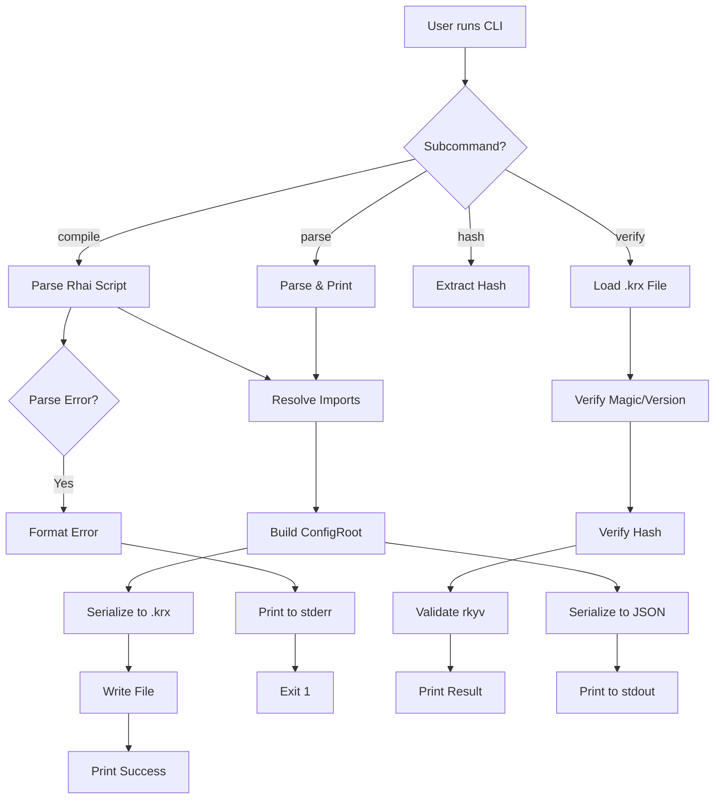

# Design Document

## Overview

The Compiler DSL Completion spec implements the remaining components of the `core-config-system`: a complete Rhai DSL parser with all configuration functions, a polished CLI with 4 subcommands, and comprehensive user documentation. This transforms the existing compiler scaffolding into a production-ready tool that users can rely on for creating keyboard remapping configurations.

**Technical Approach:**
- Extend existing Rhai engine setup with custom function registration
- Implement prefix validation as a separate validator module for reusability
- Create modular parser functions (one file per DSL function)
- Enhance CLI with clap 4.x for robust argument parsing
- Generate comprehensive documentation from code examples

## Steering Document Alignment

### Technical Standards (tech.md)

**Rhai Scripting Language:**
- Rhai 1.15+ already integrated in workspace dependencies
- Custom functions registered using `engine.register_fn()` API
- Compile-time evaluation only (no runtime script execution)
- Resource limits configured: 10,000 ops, 100 recursion depth, 10-second timeout

**rkyv Serialization:**
- Already implemented in `keyrx_compiler/src/serialize.rs`
- Deterministic binary output confirmed by existing property tests
- Zero-copy deserialization working with validation feature

**Error Handling:**
- Structured error types already defined in `keyrx_compiler/src/error/mod.rs`
- This spec adds formatted error output with user-friendly messages
- Error formatting separated into `error/formatting.rs` module

**CLI Standards:**
- clap 4.x for argument parsing (derive API)
- Structured logging with log crate (already configured)
- Exit codes: 0 for success, 1 for errors
- JSON output option for machine-readable data

### Project Structure (structure.md)

**Module Organization:**
```
keyrx_compiler/src/
├── main.rs               # CLI entry point (enhanced)
├── parser/
│   ├── mod.rs            # Public API, Rhai engine setup
│   ├── core.rs           # ParserState, Parser struct
│   ├── validators.rs     # NEW: Prefix validation functions
│   ├── functions/
│   │   ├── mod.rs        # Function registration
│   │   ├── map.rs        # ENHANCED: map() with all 3 output types
│   │   ├── tap_hold.rs   # ENHANCED: Full validation
│   │   ├── modifiers.rs  # NEW: with_shift, with_ctrl, etc.
│   │   ├── conditional.rs # ENHANCED: when() and when_not()
│   │   └── device.rs     # NEW: device() function
│   └── helpers.rs        # Utility functions
├── serialize.rs          # Already complete
├── import_resolver.rs    # Already complete
├── error/
│   ├── mod.rs            # Error types (existing)
│   └── formatting.rs     # ENHANCED: User-friendly formatting
└── cli/
    ├── mod.rs            # NEW: CLI command handlers
    ├── compile.rs        # NEW: Compile subcommand
    ├── verify.rs         # NEW: Verify subcommand
    ├── hash.rs           # NEW: Hash subcommand
    └── parse.rs          # NEW: Parse subcommand
```

**Test Organization:**
```
keyrx_compiler/tests/
├── integration_tests.rs  # ENHANCED: End-to-end workflows
├── cli_tests.rs          # ENHANCED: CLI subcommand tests
└── property_tests.rs     # Already complete
```

**Documentation:**
```
docs/
└── DSL_MANUAL.md         # NEW: Complete DSL reference

examples/
├── 01-simple-remap.rhai  # NEW: Basic example
├── 02-capslock-escape.rhai # NEW: Classic mapping
├── 03-vim-navigation.rhai  # NEW: Vim arrows
├── 04-dual-function-keys.rhai # NEW: Tap/hold
├── 05-multiple-devices.rhai # NEW: Multi-device
└── 06-advanced-layers.rhai  # NEW: Complex layers
```

## Code Reuse Analysis

### Existing Components to Leverage

**From keyrx_core:**
- `config::KeyMapping` enum with helper functions - Use for creating mappings
- `config::Condition` and `ConditionItem` enums - Use for conditional logic
- `config::KeyCode` enum - Parse user strings to KeyCode variants
- `config::BaseKeyMapping` variants - Target for parser output

**From keyrx_compiler (existing):**
- `parser/core.rs::ParserState` - Extend to track device context
- `import_resolver.rs::ImportResolver` - Already handles circular imports
- `serialize.rs::serialize()` - Already generates .krx files
- `serialize.rs::deserialize()` - Already validates .krx files
- `error/mod.rs::ParseError` - Extend with new error variants
- `tests/cli_tests.rs` - Extend with new subcommand tests

**From workspace dependencies:**
- `rhai` 1.19.0 - Engine setup and function registration
- `clap` 4.5.23 - CLI argument parsing with derive macros
- `serde_json` - JSON output for parse subcommand
- `colored` 2.0 - Terminal color output for errors

### Integration Points

**With keyrx_core:**
- Parser creates `KeyMapping` instances using helper functions
- Validator converts VK_/MD_/LK_ strings to `KeyCode` and `u8` IDs
- ConfigRoot builder aggregates DeviceConfig instances

**With existing compiler components:**
- `main.rs` routes subcommands to CLI handlers
- CLI handlers call parser → serializer → file writer
- Error formatter uses existing `ParseError` types
- Integration tests use existing test utilities

## Architecture

### High-Level Flow



### Modular Design Principles

**Single File Responsibility:**
- `map.rs` handles ONLY map() function parsing
- `tap_hold.rs` handles ONLY tap_hold() function parsing
- `validators.rs` handles ONLY string-to-type validation
- Each file <500 lines, single clear purpose

**Component Isolation:**
- Parser functions operate on shared ParserState but don't call each other
- Validators are pure functions (string in, Result<Type> out)
- CLI handlers are isolated command implementations
- Error formatters don't depend on parser internals

**Service Layer Separation:**
- Parser layer: Rhai → ConfigRoot
- Serialization layer: ConfigRoot → .krx bytes
- CLI layer: Arguments → call appropriate service
- Error layer: Errors → formatted messages

## Components and Interfaces

### Component 1: Prefix Validators (`parser/validators.rs`)

**Purpose:** Convert user-provided strings (VK_A, MD_00, LK_01) to typed values with validation

**Interfaces:**
```rust
// Parse physical key name with VK_ prefix
pub fn parse_physical_key(s: &str) -> Result<KeyCode, ParseError>;

// Parse virtual key name with VK_ prefix
pub fn parse_virtual_key(s: &str) -> Result<KeyCode, ParseError>;

// Parse modifier ID with MD_ prefix (hex 00-FE)
pub fn parse_modifier_id(s: &str) -> Result<u8, ParseError>;

// Parse lock ID with LK_ prefix (hex 00-FE)
pub fn parse_lock_id(s: &str) -> Result<u8, ParseError>;

// Parse condition string (MD_00, LK_01)
pub fn parse_condition_string(s: &str) -> Result<Condition, ParseError>;

// Parse condition item string
pub fn parse_condition_item(s: &str) -> Result<ConditionItem, ParseError>;
```

**Validation Logic:**
```rust
pub fn parse_modifier_id(s: &str) -> Result<u8, ParseError> {
    // Remove MD_ prefix
    let id_str = s.strip_prefix("MD_")
        .ok_or_else(|| ParseError::InvalidPrefix {
            expected: "MD_".to_string(),
            got: s.to_string(),
        })?;

    // Reject physical names (LShift, RCtrl, etc.)
    const PHYSICAL_MODIFIERS: &[&str] = &[
        "LShift", "RShift", "LCtrl", "RCtrl",
        "LAlt", "RAlt", "LWin", "RWin"
    ];

    for phys in PHYSICAL_MODIFIERS {
        if id_str.contains(phys) {
            return Err(ParseError::PhysicalModifierInMD {
                name: s.to_string(),
            });
        }
    }

    // Parse hex (00-FE = 0-254 decimal)
    let id = u8::from_str_radix(id_str, 16)
        .map_err(|_| ParseError::InvalidHexId {
            got: id_str.to_string(),
        })?;

    if id > 0xFE {  // 254 max (255 total: 00-FE)
        return Err(ParseError::ModifierIdOutOfRange {
            got: id,
            max: 0xFE,
        });
    }

    Ok(id)
}
```

**Dependencies:** keyrx_core::config::KeyCode, error types

**Reuses:** None (pure validation logic)

### Component 2: DSL Function Implementations (`parser/functions/*.rs`)

**Purpose:** Implement Rhai-callable functions that build ConfigRoot

**map() Implementation (`functions/map.rs`):**
```rust
pub fn register_map_function(engine: &mut Engine, state: Arc<Mutex<ParserState>>) {
    let state_clone = Arc::clone(&state);

    engine.register_fn(
        "map",
        move |from: &str, to: &str| -> Result<(), Box<EvalAltResult>> {
            let from_key = parse_physical_key(from)
                .map_err(|e| format!("Invalid 'from' key: {}", e))?;

            // Determine mapping type by prefix
            let mapping = if to.starts_with("VK_") {
                // Simple mapping
                let to_key = parse_virtual_key(to)
                    .map_err(|e| format!("Invalid 'to' key: {}", e))?;
                KeyMapping::simple(from_key, to_key)

            } else if to.starts_with("MD_") {
                // Modifier mapping
                let modifier_id = parse_modifier_id(to)
                    .map_err(|e| format!("Invalid modifier ID: {}", e))?;
                KeyMapping::modifier(from_key, modifier_id)

            } else if to.starts_with("LK_") {
                // Lock mapping
                let lock_id = parse_lock_id(to)
                    .map_err(|e| format!("Invalid lock ID: {}", e))?;
                KeyMapping::lock(from_key, lock_id)

            } else {
                return Err(ParseError::MissingPrefix {
                    key: to.to_string(),
                }.to_string().into());
            };

            // Add mapping to current device
            let mut state = state_clone.lock().unwrap();
            if let Some(ref mut device) = state.current_device {
                device.mappings.push(mapping);
                Ok(())
            } else {
                Err("map() must be called inside device() block".into())
            }
        }
    );
}
```

**tap_hold() Implementation (`functions/tap_hold.rs`):**
```rust
pub fn register_tap_hold_function(engine: &mut Engine, state: Arc<Mutex<ParserState>>) {
    let state_clone = Arc::clone(&state);

    engine.register_fn(
        "tap_hold",
        move |key: &str, tap: &str, hold: &str, threshold_ms: i64|
            -> Result<(), Box<EvalAltResult>>
        {
            let from_key = parse_physical_key(key)
                .map_err(|e| format!("Invalid key: {}", e))?;

            // Validate tap has VK_ prefix
            if !tap.starts_with("VK_") {
                return Err(ParseError::InvalidTapPrefix {
                    got: tap.to_string(),
                }.to_string().into());
            }
            let tap_key = parse_virtual_key(tap)
                .map_err(|e| format!("Invalid tap key: {}", e))?;

            // Validate hold has MD_ prefix
            if !hold.starts_with("MD_") {
                return Err(ParseError::InvalidHoldPrefix {
                    got: hold.to_string(),
                }.to_string().into());
            }
            let hold_mod = parse_modifier_id(hold)
                .map_err(|e| format!("Invalid hold modifier: {}", e))?;

            let mapping = KeyMapping::tap_hold(
                from_key,
                tap_key,
                hold_mod,
                threshold_ms as u16,
            );

            let mut state = state_clone.lock().unwrap();
            if let Some(ref mut device) = state.current_device {
                device.mappings.push(mapping);
                Ok(())
            } else {
                Err("tap_hold() must be called inside device() block".into())
            }
        }
    );
}
```

**Helper Functions (`functions/modifiers.rs`):**
```rust
// ModifiedKey is a temporary struct for builder pattern
#[derive(Clone)]
pub struct ModifiedKey {
    pub key: KeyCode,
    pub shift: bool,
    pub ctrl: bool,
    pub alt: bool,
    pub win: bool,
}

pub fn register_modifier_helpers(engine: &mut Engine) {
    // with_shift(key)
    engine.register_fn(
        "with_shift",
        |key: &str| -> Result<ModifiedKey, Box<EvalAltResult>> {
            let vk = parse_virtual_key(key)
                .map_err(|e| format!("Invalid key: {}", e))?;
            Ok(ModifiedKey {
                key: vk,
                shift: true,
                ctrl: false,
                alt: false,
                win: false,
            })
        }
    );

    // with_ctrl(key)
    engine.register_fn("with_ctrl", |key: &str| -> Result<ModifiedKey, Box<EvalAltResult>> {
        let vk = parse_virtual_key(key)?;
        Ok(ModifiedKey { key: vk, shift: false, ctrl: true, alt: false, win: false })
    });

    // with_alt(key), with_win(key) - similar

    // with_mods(key, shift, ctrl, alt, win)
    engine.register_fn(
        "with_mods",
        |key: &str, shift: bool, ctrl: bool, alt: bool, win: bool|
            -> Result<ModifiedKey, Box<EvalAltResult>>
        {
            let vk = parse_virtual_key(key)?;
            Ok(ModifiedKey { key: vk, shift, ctrl, alt, win })
        }
    );

    // Register map() overload that accepts ModifiedKey
    engine.register_fn(
        "map",
        move |from: &str, to: ModifiedKey| -> Result<(), Box<EvalAltResult>> {
            let from_key = parse_physical_key(from)?;
            let mapping = KeyMapping::modified_output(
                from_key,
                to.key,
                to.shift,
                to.ctrl,
                to.alt,
                to.win,
            );
            // Add to current device...
        }
    );
}
```

**Dependencies:** Rhai, validators, ParserState, KeyMapping helpers

**Reuses:** Existing KeyMapping helper functions

### Component 3: CLI Handlers (`cli/*.rs`)

**Purpose:** Implement subcommand logic (compile, verify, hash, parse)

**Compile Handler (`cli/compile.rs`):**
```rust
pub fn handle_compile(input: &Path, output: &Path) -> Result<(), CompileError> {
    // 1. Parse Rhai script
    eprintln!("[INFO] Parsing {}", input.display());
    let parser = Parser::new();
    let config = parser.parse_file(input)?;

    // 2. Serialize to .krx
    eprintln!("[INFO] Generating binary...");
    let bytes = serialize(&config)?;

    // 3. Write output
    eprintln!("[INFO] Writing to {}", output.display());
    std::fs::write(output, &bytes)?;

    // 4. Print success with hash
    let hash = extract_hash(&bytes);
    let size = bytes.len();
    eprintln!("[INFO] Output written to {} ({} bytes)", output.display(), size);
    eprintln!("[INFO] SHA256: {}", hex::encode(hash));
    eprintln!("✓ Compilation successful");

    Ok(())
}
```

**Verify Handler (`cli/verify.rs`):**
```rust
pub fn handle_verify(file: &Path) -> Result<(), VerifyError> {
    eprintln!("Verifying {}...", file.display());

    let bytes = std::fs::read(file)?;

    // Deserialize performs all validation
    match deserialize(&bytes) {
        Ok(_config) => {
            eprintln!("✓ Magic bytes valid (KRX\\n)");
            eprintln!("✓ Version: 1");
            eprintln!("✓ SHA256 hash matches");
            eprintln!("✓ Data size: {} bytes", bytes.len() - 48);
            eprintln!("✓ rkyv structure valid");
            eprintln!("\n✓ Verification passed");
            Ok(())
        }
        Err(e) => {
            eprintln!("✗ Verification failed: {}", e);
            Err(e.into())
        }
    }
}
```

**Hash Handler (`cli/hash.rs`):**
```rust
pub fn handle_hash(file: &Path, verify: bool) -> Result<(), HashError> {
    let bytes = std::fs::read(file)?;

    if bytes.len() < 48 {
        return Err(HashError::FileTooSmall);
    }

    // Extract embedded hash (bytes 8-40)
    let embedded_hash = &bytes[8..40];
    println!("{}", hex::encode(embedded_hash));

    if verify {
        // Compute hash of data section
        let data = &bytes[48..];
        let mut hasher = Sha256::new();
        hasher.update(data);
        let computed_hash: [u8; 32] = hasher.finalize().into();

        if embedded_hash == computed_hash {
            eprintln!("✓ Hash matches");
        } else {
            eprintln!("✗ Hash mismatch");
            return Err(HashError::HashMismatch);
        }
    }

    Ok(())
}
```

**Parse Handler (`cli/parse.rs`):**
```rust
pub fn handle_parse(input: &Path, json: bool) -> Result<(), ParseError> {
    let parser = Parser::new();
    let config = parser.parse_file(input)?;

    if json {
        // JSON output
        let json_str = serde_json::to_string_pretty(&config)
            .map_err(|e| ParseError::SerializationError(e.to_string()))?;
        println!("{}", json_str);
    } else {
        // Human-readable summary
        println!("Configuration Summary:");
        println!("  Version: {}.{}.{}", config.version.major, config.version.minor, config.version.patch);
        println!("  Devices: {}", config.devices.len());
        for device in &config.devices {
            println!("    - Pattern: {}", device.identifier.pattern);
            println!("      Mappings: {}", device.mappings.len());
        }
    }

    Ok(())
}
```

**Dependencies:** clap, parser, serializer, error formatters

**Reuses:** Existing Parser, serialize(), deserialize()

### Component 4: Error Formatting (`error/formatting.rs`)

**Purpose:** Convert ParseError to user-friendly colored terminal output

**Interface:**
```rust
pub fn format_error(error: &ParseError, file: &Path, source: &str) -> String;
```

**Implementation Approach:**
```rust
pub fn format_error(error: &ParseError, file: &Path, source: &str) -> String {
    use colored::*;

    let mut output = String::new();

    // Header: Error type in red
    output.push_str(&format!("{}: ", "Error".red().bold()));

    match error {
        ParseError::MissingPrefix { key } => {
            output.push_str(&format!("Missing prefix on output key\n"));

            // Show location if available
            if let Some((line, col)) = error.location() {
                output.push_str(&format!("  {} {}:{}\n",
                    "-->".blue(),
                    file.display(),
                    line
                ));

                // Show code snippet
                output.push_str(&format_code_snippet(source, line, col));
            }

            output.push_str(&format!("\n{} Output must have VK_, MD_, or LK_ prefix\n",
                "=".blue()
            ));
            output.push_str(&format!("\n{}\n", "help:".green().bold()));
            output.push_str(&format!("  Use \"VK_{}\" for virtual key output\n", key.strip_prefix("VK_").unwrap_or(key)));
            output.push_str(&format!("  Use \"MD_XX\" for modifier assignment (e.g., \"MD_00\")\n"));
            output.push_str(&format!("  Use \"LK_XX\" for lock assignment (e.g., \"LK_01\")\n"));
        }

        ParseError::PhysicalModifierInMD { name } => {
            output.push_str(&format!("Invalid modifier ID: cannot use physical modifier names in MD_\n"));
            // ... similar formatting
            output.push_str(&format!("\n{}\n", "help:".green().bold()));
            output.push_str(&format!("  Use hex IDs MD_00 through MD_FE\n"));
            output.push_str(&format!("  Physical modifiers (Shift, Ctrl, Alt, Win) are for output only:\n"));
            output.push_str(&format!("    map(\"VK_1\", with_shift(\"VK_1\"))  // Correct\n"));
        }

        // ... other error types
    }

    output
}

fn format_code_snippet(source: &str, line: usize, col: usize) -> String {
    let lines: Vec<&str> = source.lines().collect();
    let mut output = String::new();

    // Show line with error
    if let Some(error_line) = lines.get(line - 1) {
        output.push_str(&format!("{:4} | {}\n", line, error_line));
        output.push_str(&format!("     | {}{}\n",
            " ".repeat(col - 1),
            "^".red().bold()
        ));
    }

    output
}
```

**Dependencies:** colored crate, ParseError types

**Reuses:** None (pure formatting)

## Data Models

### ModifiedKey (Temporary Builder Struct)

```rust
/// Temporary struct returned by with_shift(), with_ctrl(), etc.
/// Consumed by map() overload to create ModifiedOutput mapping.
#[derive(Clone, Debug)]
pub struct ModifiedKey {
    pub key: KeyCode,
    pub shift: bool,
    pub ctrl: bool,
    pub alt: bool,
    pub win: bool,
}
```

**Purpose:** Enable builder pattern for physical modifier output

**Lifecycle:**
1. User calls `with_shift("VK_1")` → returns ModifiedKey
2. User passes ModifiedKey to `map("VK_2", with_shift("VK_1"))`
3. map() consumes ModifiedKey and creates KeyMapping::modified_output()

### ParserState (Extended)

```rust
/// Parser state shared across Rhai function calls
pub struct ParserState {
    /// Current device being configured (set by device() function)
    pub current_device: Option<DeviceConfig>,

    /// All configured devices
    pub devices: Vec<DeviceConfig>,

    /// Metadata for compilation
    pub metadata: Metadata,
}

impl ParserState {
    pub fn finalize(self) -> ConfigRoot {
        ConfigRoot {
            version: Version::current(),
            devices: self.devices,
            metadata: self.metadata,
        }
    }
}
```

**Changes from existing:** Added `current_device` field to track active device context

## Error Handling

### Error Scenarios

1. **Scenario: Missing Prefix (VK_/MD_/LK_)**
   - **Handling:** Detect in parse_virtual_key(), parse_modifier_id(), parse_lock_id()
   - **User Impact:** Clear error with all valid prefixes and examples
   - **Example:**
     ```
     Error: Missing prefix on output key
       --> main.rhai:5:15
        |
      5 |     map("VK_A", "B");
        |                  ^ Output must have VK_, MD_, or LK_ prefix
        |
     help: Use "VK_B" for virtual key output
     ```

2. **Scenario: Physical Modifier in MD_**
   - **Handling:** Check for physical names (LShift, RCtrl, etc.) in parse_modifier_id()
   - **User Impact:** Explanation that MD_ is for custom modifiers only, physical modifiers are for output
   - **Example:**
     ```
     Error: Invalid modifier ID: cannot use physical modifier names in MD_
       --> main.rhai:8:45
        |
      8 |     tap_hold("VK_Space", "VK_Space", "MD_LShift", 200);
        |                                       ^^^^^^^^^^ Cannot use physical names
        |
     help: Use hex IDs MD_00 through MD_FE
     note: Physical modifiers are for output only: with_shift("VK_A")
     ```

3. **Scenario: ID Out of Range**
   - **Handling:** Check value >0xFE in parse_modifier_id()/parse_lock_id()
   - **User Impact:** Clear range explanation (MD_00 through MD_FE = 0-254)
   - **Example:**
     ```
     Error: Modifier ID out of range
       --> main.rhai:10:20
        |
     10 |     map("VK_A", "MD_FF");
        |                  ^^^^^ ID must be in range MD_00 through MD_FE (0-254)
     ```

4. **Scenario: Function Called Outside Device Block**
   - **Handling:** Check `state.current_device.is_some()` in each function
   - **User Impact:** Explain that map/tap_hold must be inside device() closure
   - **Example:**
     ```
     Error: map() must be called inside device() block
       --> main.rhai:3:1
        |
      3 | map("VK_A", "VK_B");
        | ^^^^^^^^^^^^^^^^^^^ Not inside device() closure
        |
     help: Wrap in device() block:
           device("*", || {
               map("VK_A", "VK_B");
           });
     ```

5. **Scenario: Circular Import**
   - **Handling:** Already handled by ImportResolver
   - **User Impact:** Show import chain (main.rhai → a.rhai → b.rhai → a.rhai)
   - **Example:**
     ```
     Error: Circular import detected
       --> main.rhai:1:1
        |
      1 | import "a.rhai";
        | ^^^^^^^^^^^^^^^^
        |
     Import chain:
       main.rhai
       → a.rhai (line 5)
       → b.rhai (line 2)
       → a.rhai (circular)
     ```

## Testing Strategy

### Unit Testing

**Validator Tests** (`tests/validators_tests.rs`):
- Test parse_physical_key() with all VK_ names
- Test parse_modifier_id() with valid range (MD_00 through MD_FE)
- Test parse_modifier_id() rejects physical names (MD_LShift)
- Test parse_modifier_id() rejects out-of-range (MD_FF)
- Test parse_lock_id() with valid range
- Test parse_condition_string() with all condition types

**Parser Function Tests** (`tests/parser_function_tests.rs`):
- Test map() creates Simple mapping for VK_ output
- Test map() creates Modifier mapping for MD_ output
- Test map() creates Lock mapping for LK_ output
- Test tap_hold() validates tap has VK_ prefix
- Test tap_hold() validates hold has MD_ prefix
- Test with_shift() returns ModifiedKey
- Test when() creates Conditional with single condition
- Test when() creates Conditional with AllActive for arrays
- Test when_not() creates Conditional with NotActive

**Coverage Target:** 90%+

### Integration Testing

**End-to-End Workflows** (`tests/integration_tests.rs`):
- Compile simple config → verify .krx output
- Compile config with all mapping types → verify all present
- Compile config with imports → verify import resolution
- Compile config with error → verify error message
- Compile same config twice → verify byte-identical output
- Compile config, then verify → pass
- Corrupt .krx magic bytes → verify fails
- Corrupt .krx hash → verify fails

**CLI Tests** (`tests/cli_tests.rs`):
- Run `compile input.rhai -o output.krx` → verify file created
- Run `verify valid.krx` → exit code 0
- Run `verify invalid.krx` → exit code 1
- Run `hash valid.krx` → print hash
- Run `hash valid.krx --verify` → verify hash matches
- Run `parse input.rhai` → print summary
- Run `parse input.rhai --json` → print JSON
- Run `keyrx_compiler --help` → print help
- Run `keyrx_compiler invalid` → print error

**Test Fixtures:** Use real .rhai files in `tests/fixtures/`

### Property-Based Testing

**Existing Tests** (already in `tests/property_tests.rs`):
- serialize(config) never panics
- deserialize(serialize(config)) == config (round-trip)
- serialize(config) is deterministic

**No Additional Property Tests Needed** (serialization already thoroughly tested)

### Documentation Testing

**Example Validation:**
- All .rhai examples in `examples/` must compile without errors
- Run in CI: `for f in examples/*.rhai; do keyrx_compiler compile "$f" -o /dev/null || exit 1; done`
- Code snippets in DSL_MANUAL.md extracted and tested (using mdbook or similar)

### Error Message Testing

**Error Formatting Tests** (`tests/error_formatting_tests.rs`):
- Test each ParseError variant produces expected formatted output
- Verify code snippets show correct line numbers
- Verify help text is actionable
- Test with/without colored output (NO_COLOR env var)
