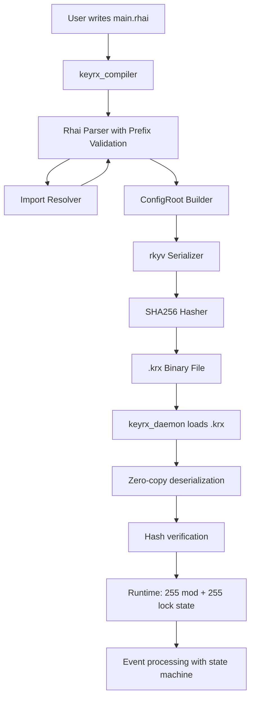

# Design Document

## Overview

The Core Configuration System enables users to define keyboard remapping configurations in Rhai scripts and compile them into deterministic, zero-copy binary files (.krx format). The finalized design supports:

1. **255 custom modifiers** (MD_00-MD_FE) - Keys can act as custom modifiers
2. **255 custom locks** (LK_00-LK_FE) - Keys can toggle custom lock states
3. **Physical modifier outputs** (Shift+2, Ctrl+C) - Output keys with OS modifiers
4. **Tap/hold behavior** - Dual behavior (tap=key, hold=modifier)
5. **Nested modifier cascades** - Modifiers can activate other modifiers
6. **Cross-device state sharing** - Global modifier/lock state across all keyboards
7. **Platform-agnostic KeyCode** - Universal key representation

**Architecture**: Compile-time Rhai evaluation → Deterministic binary → Zero-copy runtime

## Steering Document Alignment

### Technical Standards (tech.md)

**Rhai Scripting Language**:
- Rhai 1.15+ for DSL implementation
- Custom functions: `map()`, `tap_hold()`, `when()`, `when_not()`, `device()`, `with_shift()`, `with_ctrl()`, `with_alt()`, `with_mods()`
- Compile-time evaluation (no runtime script execution)
- Resource limits: 10,000 ops, 100 recursion depth, 10-second timeout

**rkyv Serialization**:
- rkyv 0.7+ with validation features
- Deterministic binary output (same config → same bytes → same hash)
- Zero-copy deserialization (<5ms load time)
- 48-byte header: magic (4B), version (4B), SHA256 hash (32B), size (8B)

**no_std Core**:
- keyrx_core compiles without std library (WASM-compatible)
- Platform-agnostic KeyCode enum (Linux evdev, Windows VK codes → KeyCode)
- Fixed-size data structures (arrayvec, fixedbitset)

### Project Structure (structure.md)

**Module Organization**:
```
keyrx_core/src/
├── config.rs          # Configuration data structures (no_std)
└── lib.rs             # Public API exports

keyrx_compiler/src/
├── main.rs            # CLI entry point
├── parser.rs          # Rhai DSL evaluator with prefix validation
├── serialize.rs       # rkyv binary serialization
├── import_resolver.rs # Import system
├── error.rs           # Structured error types
└── helpers.rs         # Helper functions (with_shift, etc.)
```

## Code Reuse Analysis

### Existing Components to Leverage

**From ai-dev-foundation**:
- Build scripts (`scripts/build.sh`, `scripts/verify.sh`)
- Testing infrastructure (cargo test, property-based tests, fuzzing)
- CI/CD workflows (GitHub Actions)
- Pre-commit hooks for quality gates

**From Workspace Dependencies**:
- `rkyv` - Zero-copy serialization
- `rhai` - Scripting engine
- `clap` - CLI parsing
- `serde` - JSON output for debugging
- `sha2` - SHA256 hashing

### New Code to Create

All config system code is greenfield:
- Configuration data structures with 6 KeyMapping variants
- Rhai DSL parser with prefix validation (VK_/MD_/LK_)
- Helper function implementations (with_shift, with_ctrl, with_alt, with_mods)
- Binary serializer with deterministic output
- Import resolution with circular detection
- CLI compiler with 4 subcommands

## Architecture

### High-Level Flow



### Platform Translation Layer

```
Linux (evdev):
  Physical: evdev scancode 30 (KEY_A)
  ↓
  KeyCode::A (0x00) - platform-agnostic
  ↓
  Virtual: evdev scancode 48 (KEY_B)

Windows:
  Physical: VK_A (0x41)
  ↓
  KeyCode::A (0x00) - platform-agnostic
  ↓
  Virtual: VK_B (0x42)
```

**Same .krx file works on both platforms!**

## Components and Interfaces

### Component 1: Configuration Data Structures (`keyrx_core/src/config.rs`)

**Purpose**: Define platform-agnostic configuration data model

**Key Types**:

```rust
// Platform-agnostic key codes (100+ keys)
#[repr(u16)]
enum KeyCode {
    // Letters: A=0x00, B=0x01, ..., Z=0x19
    A = 0x00, B = 0x01, /* ... */ Z = 0x19,

    // Numbers: Num0=0x20, ..., Num9=0x29
    Num0 = 0x20, /* ... */ Num9 = 0x29,

    // Function keys: F1=0x30, ..., F12=0x3B
    F1 = 0x30, /* ... */ F12 = 0x3B,

    // Modifiers: LShift=0x40, RShift, LCtrl, RCtrl, LAlt, RAlt, LWin, RWin
    LShift = 0x40, /* ... */

    // Special: Enter, Escape, Backspace, Tab, Space, etc.
    Enter = 0x50, Escape = 0x51, /* ... */

    // Arrows: Left, Right, Up, Down
    Left = 0x60, Right = 0x61, Up = 0x62, Down = 0x63,

    // 100+ total variants
}

// Base key mapping types (non-recursive leaf mappings)
#[repr(C)]
enum BaseKeyMapping {
    // Simple 1:1 remapping
    Simple { from: KeyCode, to: KeyCode },

    // Key acts as custom modifier (MD_00-MD_FE)
    Modifier { from: KeyCode, modifier_id: u8 },

    // Key toggles custom lock (LK_00-LK_FE)
    Lock { from: KeyCode, lock_id: u8 },

    // Tap/hold: tap outputs key, hold activates modifier
    TapHold {
        from: KeyCode,
        tap: KeyCode,
        hold_modifier: u8,  // MD_00-MD_FE
        threshold_ms: u16,
    },

    // Output with physical modifiers (Shift+2, Ctrl+C)
    ModifiedOutput {
        from: KeyCode,
        to: KeyCode,
        shift: bool,
        ctrl: bool,
        alt: bool,
        win: bool,
    },
}

// Key mapping with conditional support (split from BaseKeyMapping)
// This split design avoids rkyv recursion issues with 0.7
#[repr(C)]
enum KeyMapping {
    // Wrap base mapping types
    Base(BaseKeyMapping),

    // Conditional mappings (when/when_not blocks)
    Conditional {
        condition: Condition,
        mappings: Vec<BaseKeyMapping>,  // Limited to 1-level nesting
    },
}

// Ergonomic helper functions hide the split design
impl KeyMapping {
    fn simple(from: KeyCode, to: KeyCode) -> Self;
    fn modifier(from: KeyCode, modifier_id: u8) -> Self;
    fn lock(from: KeyCode, lock_id: u8) -> Self;
    fn tap_hold(from: KeyCode, tap: KeyCode, hold_modifier: u8, threshold_ms: u16) -> Self;
    fn modified_output(from: KeyCode, to: KeyCode, shift: bool, ctrl: bool, alt: bool, win: bool) -> Self;
    fn conditional(condition: Condition, mappings: Vec<BaseKeyMapping>) -> Self;
}

// Condition types for when/when_not
#[repr(C)]
enum Condition {
    ModifierActive(u8),           // MD_XX active
    LockActive(u8),               // LK_XX active
    AllActive(Vec<ConditionItem>), // All must be true (AND)
    NotActive(Vec<ConditionItem>), // Negation (when_not) - limited to item negation
}

#[repr(C)]
enum ConditionItem {
    ModifierActive(u8),  // MD_XX
    LockActive(u8),      // LK_XX
}

// Root configuration
#[repr(C)]
struct ConfigRoot {
    version: Version,
    devices: Vec<DeviceConfig>,
    metadata: Metadata,
}

#[repr(C)]
struct DeviceConfig {
    identifier: DeviceIdentifier,
    mappings: Vec<KeyMapping>,
}
```

**Dependencies**: rkyv, arrayvec (no_std compatible)

### Component 2: Rhai DSL Parser (`keyrx_compiler/src/parser.rs`)

**Purpose**: Parse Rhai scripts with prefix validation

**Interfaces**:
- `parse_script(path: &Path) -> Result<ConfigRoot, ParseError>`
- Rhai custom functions registered in engine

**Custom Functions**:

```rust
// map(from, to) with prefix validation
fn rhai_map(from: String, to: String) -> Result<(), ParseError> {
    let from_key = parse_physical_key(&from)?;

    // Validate prefix and create appropriate mapping
    if to.starts_with("VK_") {
        // Simple mapping
        let to_key = parse_virtual_key(&to)?;
        add_mapping(KeyMapping::Simple { from: from_key, to: to_key });
    } else if to.starts_with("MD_") {
        // Modifier mapping
        let mod_id = parse_modifier_id(&to)?;  // Validates 00-FE range
        add_mapping(KeyMapping::Modifier { from: from_key, modifier_id: mod_id });
    } else if to.starts_with("LK_") {
        // Lock mapping
        let lock_id = parse_lock_id(&to)?;  // Validates 00-FE range
        add_mapping(KeyMapping::Lock { from: from_key, lock_id: lock_id });
    } else {
        return Err(ParseError::MissingPrefix { key: to });
    }
}

// tap_hold(key, tap, hold, threshold_ms) with validation
fn rhai_tap_hold(key: String, tap: String, hold: String, threshold_ms: i64) -> Result<(), ParseError> {
    let from_key = parse_physical_key(&key)?;

    // Validate tap has VK_ prefix
    if !tap.starts_with("VK_") {
        return Err(ParseError::InvalidTapPrefix { got: tap });
    }
    let tap_key = parse_virtual_key(&tap)?;

    // Validate hold has MD_ prefix (NO physical names)
    if !hold.starts_with("MD_") {
        return Err(ParseError::InvalidHoldPrefix { got: hold });
    }
    if hold.contains("LShift") || hold.contains("Ctrl") {
        return Err(ParseError::PhysicalModifierInMD { name: hold });
    }
    let hold_mod = parse_modifier_id(&hold)?;

    add_mapping(KeyMapping::TapHold {
        from: from_key,
        tap: tap_key,
        hold_modifier: hold_mod,
        threshold_ms: threshold_ms as u16,
    });
}

// when(condition) { ... } with array support
fn rhai_when(condition: Dynamic, closure: FnPtr) -> Result<(), ParseError> {
    let cond = if condition.is::<String>() {
        // Single condition: "MD_00" or "LK_01"
        parse_single_condition(condition.cast::<String>())?
    } else if condition.is::<Array>() {
        // Multiple conditions (AND): ["MD_00", "LK_01"]
        let items = condition.cast::<Array>()
            .iter()
            .map(|s| parse_condition_item(s.cast::<String>()))
            .collect::<Result<Vec<_>, _>>()?;
        Condition::AllActive(items)
    } else {
        return Err(ParseError::InvalidConditionType);
    };

    // Execute closure to collect nested mappings
    let mappings = execute_closure_and_collect(closure)?;

    add_mapping(KeyMapping::Conditional {
        condition: cond,
        mappings,
    });
}

// Helper functions for physical modifier outputs
fn rhai_with_shift(key: String) -> Result<ModifiedKey, ParseError> {
    validate_vk_prefix(&key)?;
    let vk = parse_virtual_key(&key)?;
    Ok(ModifiedKey { key: vk, shift: true, ctrl: false, alt: false, win: false })
}

// Similar for with_ctrl, with_alt, with_mods
```

**Prefix Validation Logic**:

```rust
fn parse_modifier_id(s: &str) -> Result<u8, ParseError> {
    // Remove MD_ prefix
    let id_str = s.strip_prefix("MD_")
        .ok_or_else(|| ParseError::InvalidPrefix { expected: "MD_", got: s.to_string() })?;

    // Reject physical names
    if id_str.contains("Shift") || id_str.contains("Ctrl") || id_str.contains("Alt") {
        return Err(ParseError::PhysicalModifierInMD { name: s.to_string() });
    }

    // Parse hex (00-FE = 0-254 decimal)
    let id = u8::from_str_radix(id_str, 16)
        .map_err(|_| ParseError::InvalidHexId { got: id_str.to_string() })?;

    if id > 0xFE {  // 254 max (255 total: 00-FE)
        return Err(ParseError::ModifierIdOutOfRange { got: id, max: 0xFE });
    }

    Ok(id)
}
```

**Dependencies**: Rhai, error types, import resolver

### Component 3: Binary Serializer (`keyrx_compiler/src/serialize.rs`)

**Purpose**: Deterministic binary serialization with hash verification

**Binary Format**:
```
Offset | Size | Field
-------|------|------
0x00   | 4    | Magic bytes (0x4B 0x52 0x58 0x0A = "KRX\n")
0x04   | 4    | Version (u32, little-endian)
0x08   | 32   | SHA256 hash of data (bytes 0x30+)
0x28   | 8    | Data size (u64, little-endian)
0x30   | N    | rkyv-serialized ConfigRoot
```

**Interfaces**:
```rust
fn serialize(config: &ConfigRoot) -> Result<Vec<u8>, SerializeError> {
    // 1. Serialize ConfigRoot with rkyv (deterministic)
    let data = rkyv::to_bytes::<_, 4096>(config)?;

    // 2. Compute SHA256 hash
    let hash = sha2::Sha256::digest(&data);

    // 3. Build header
    let mut output = Vec::with_capacity(48 + data.len());
    output.extend_from_slice(&KRX_MAGIC);          // 4 bytes
    output.extend_from_slice(&KRX_VERSION.to_le_bytes());  // 4 bytes
    output.extend_from_slice(&hash);               // 32 bytes
    output.extend_from_slice(&(data.len() as u64).to_le_bytes());  // 8 bytes
    output.extend_from_slice(&data);               // N bytes

    Ok(output)
}

fn deserialize(bytes: &[u8]) -> Result<&ArchivedConfigRoot, DeserializeError> {
    // 1. Verify magic bytes
    if &bytes[0..4] != KRX_MAGIC {
        return Err(DeserializeError::InvalidMagic);
    }

    // 2. Verify version
    let version = u32::from_le_bytes(bytes[4..8].try_into()?);
    if version != KRX_VERSION {
        return Err(DeserializeError::VersionMismatch { got: version, expected: KRX_VERSION });
    }

    // 3. Verify hash
    let embedded_hash = &bytes[8..40];
    let data = &bytes[48..];
    let computed_hash = sha2::Sha256::digest(data);
    if embedded_hash != computed_hash.as_slice() {
        return Err(DeserializeError::HashMismatch);
    }

    // 4. Zero-copy deserialize (validates structure)
    let config = rkyv::check_archived_root::<ConfigRoot>(data)?;

    Ok(config)
}
```

**Dependencies**: rkyv, sha2

### Component 4: Import Resolver (`keyrx_compiler/src/import_resolver.rs`)

**Purpose**: Resolve Rhai imports with circular detection

**Interfaces**:
```rust
struct ImportResolver {
    visited: HashSet<PathBuf>,
    import_chain: Vec<PathBuf>,
}

impl ImportResolver {
    fn resolve(&mut self, path: &Path) -> Result<String, ImportError> {
        // Detect circular imports
        if self.visited.contains(path) {
            return Err(ImportError::CircularImport {
                chain: self.import_chain.clone(),
            });
        }

        // Read file
        let content = std::fs::read_to_string(path)?;

        // Track in chain
        self.visited.insert(path.to_path_buf());
        self.import_chain.push(path.to_path_buf());

        // Parse and resolve nested imports
        // (Rhai engine will call this recursively via import statement handler)

        Ok(content)
    }
}
```

### Component 5: CLI Interface (`keyrx_compiler/src/main.rs`)

**Purpose**: User-facing command-line interface

**Subcommands**:
```rust
#[derive(Parser)]
enum Command {
    Compile {
        input: PathBuf,
        #[arg(short, long)]
        output: PathBuf,
    },
    Verify {
        file: PathBuf,
    },
    Hash {
        file: PathBuf,
    },
    Parse {
        input: PathBuf,
        #[arg(long)]
        json: bool,
    },
}
```

**Dependencies**: clap, parser, serializer, error formatting

## Data Models

See Component 1 for complete data model definitions. Key points:

- **KeyCode**: Platform-agnostic (100+ keys)
- **KeyMapping**: 6 variants (Simple, Modifier, Lock, TapHold, ModifiedOutput, Conditional)
- **Condition**: 4 variants (ModifierActive, LockActive, AllActive, NotActive)
- **255 modifiers** (u8: 0-254), **255 locks** (u8: 0-254)

## Error Handling

### Error Types

```rust
enum ParseError {
    MissingPrefix { key: String },
    InvalidPrefix { expected: String, got: String },
    PhysicalModifierInMD { name: String },
    ModifierIdOutOfRange { got: u8, max: u8 },
    InvalidHexId { got: String },
    InvalidTapPrefix { got: String },
    InvalidHoldPrefix { got: String },
    SyntaxError { file: String, line: usize, column: usize, message: String },
    // ... more
}

enum SerializeError {
    RkyvError(rkyv::Error),
    IoError(std::io::Error),
}

enum DeserializeError {
    InvalidMagic,
    VersionMismatch { got: u32, expected: u32 },
    HashMismatch,
    RkyvError(rkyv::validation::CheckArchiveError),
}

enum ImportError {
    CircularImport { chain: Vec<PathBuf> },
    FileNotFound { path: PathBuf, searched: Vec<PathBuf> },
    // ... more
}
```

### User-Friendly Error Messages

```rust
impl Display for ParseError {
    fn fmt(&self, f: &mut Formatter) -> fmt::Result {
        match self {
            ParseError::MissingPrefix { key } => {
                write!(f, "Output must have VK_, MD_, or LK_ prefix: {}", key)
            }
            ParseError::PhysicalModifierInMD { name } => {
                write!(f, "Invalid modifier name: {} (use MD_00 through MD_FE, not physical names like MD_LShift)", name)
            }
            ParseError::ModifierIdOutOfRange { got, max } => {
                write!(f, "Modifier ID out of range: MD_{:02X} (must be MD_00 through MD_{:02X})", got, max)
            }
            // ... more
        }
    }
}
```

## Testing Strategy

### Unit Testing
- **Config structures**: Serialization round-trips, rkyv trait derivation
- **Prefix validation**: All 6 KeyMapping variants, error cases
- **Parser**: Each custom function (map, tap_hold, when, when_not, with_shift, etc.)
- **Import resolver**: Circular detection, relative paths
- **Serializer**: Deterministic output, hash computation

**Coverage Target**: 90%

### Integration Testing
- **End-to-end**: Rhai script → .krx → verify → deserialize
- **Multi-file imports**: 3+ files with nested imports
- **All DSL features**: 255 modifiers, 255 locks, tap/hold, conditionals, physical modifiers
- **Error scenarios**: Invalid prefixes, out-of-range IDs, circular imports

### Property-Based Testing
- **Determinism**: `serialize(config) == serialize(config)` (multiple runs)
- **Round-trip**: `deserialize(serialize(config)) == config`
- **Hash stability**: Same config → same hash always

**Framework**: proptest with 1000+ iterations

### Fuzz Testing
- **Parser**: Random Rhai scripts (no panics)
- **Deserializer**: Random bytes (no panics, no UB)

**Duration**: 60+ seconds in CI
