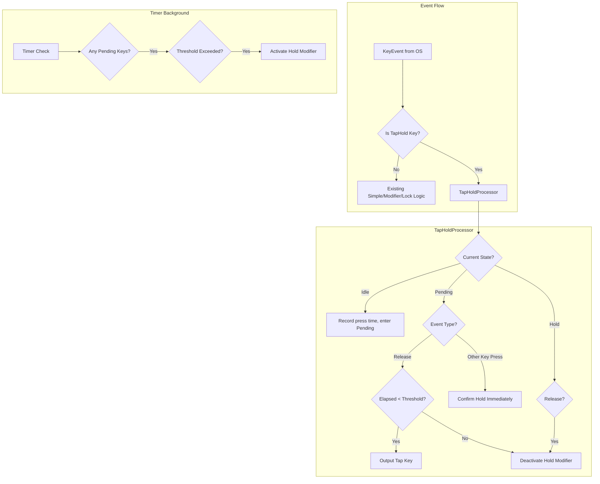

# Design Document: Tap-Hold Functionality

## Overview

Tap-Hold implements dual-function key behavior through a Deterministic Finite Automaton (DFA) that tracks key press timing. The system decides between "tap" (quick release) and "hold" (sustained press) based on configurable time thresholds, enabling keys like CapsLock to serve multiple purposes.

The implementation follows keyrx's core principles: sub-millisecond latency, deterministic behavior, and WASM compatibility for browser-based simulation.

## Steering Document Alignment

### Technical Standards (tech.md)
- **no_std Core**: State machine implemented in keyrx_core without std dependencies
- **Zero-copy processing**: No heap allocation in hot path
- **Virtual clock for testing**: Time abstraction via `Clock` trait
- **rkyv serialization**: TapHold config already serializable (existing infrastructure)

### Project Structure (structure.md)
- State machine logic in `keyrx_core/src/runtime/tap_hold.rs`
- Time abstraction in `keyrx_core/src/runtime/clock.rs`
- Integration in `keyrx_core/src/runtime/event.rs`
- Tests in `keyrx_core/src/runtime/tap_hold.rs` (inline) and `keyrx_core/tests/`

## Code Reuse Analysis

### Existing Components to Leverage
- **BaseKeyMapping::TapHold**: Already defined in `keyrx_core/src/config/mappings.rs` (complete)
- **tap_hold() DSL function**: Already implemented in `keyrx_compiler/src/parser/functions/tap_hold.rs` (complete)
- **DeviceState**: Existing modifier/lock state management in `keyrx_core/src/runtime/state.rs`
- **KeyEvent**: Existing event structure (needs timestamp field addition)
- **process_event()**: Existing event processing pipeline (needs tap-hold branch implementation)

### Integration Points
- **Event Processing**: Insert tap-hold logic into `process_event()` match arm
- **State Management**: Use existing `DeviceState.modifiers` for hold modifier activation
- **Daemon Event Loop**: Pass OS timestamps through to keyrx_core

## Architecture

The tap-hold system uses a state machine per pending key, managed by a `TapHoldProcessor` that integrates with the existing event processing pipeline.

### Modular Design Principles
- **Single File Responsibility**: `tap_hold.rs` handles only state machine logic
- **Component Isolation**: `Clock` trait isolates time source (real vs virtual)
- **Service Layer Separation**: State machine pure logic, daemon handles I/O
- **Utility Modularity**: Timer utilities reusable for future features (combos, macros)



## Components and Interfaces

### Component 1: Clock Trait
- **Purpose**: Abstract time source for deterministic testing
- **Interfaces**:
  ```rust
  pub trait Clock {
      fn now(&self) -> u64; // Microseconds since epoch
  }
  ```
- **Dependencies**: None
- **Reuses**: New component (enables DST principle from product.md)

### Component 2: TapHoldState
- **Purpose**: Represent state of a single pending tap-hold key
- **Interfaces**:
  ```rust
  #[derive(Clone, Copy)]
  pub enum TapHoldPhase {
      Idle,
      Pending { pressed_at: u64 },
      Hold,
  }

  pub struct TapHoldState {
      pub key: KeyCode,
      pub phase: TapHoldPhase,
      pub tap_key: KeyCode,
      pub hold_modifier: u8,
      pub threshold_us: u64,
  }
  ```
- **Dependencies**: KeyCode from keyrx_core
- **Reuses**: Existing KeyCode type

### Component 3: TapHoldProcessor
- **Purpose**: Manage multiple tap-hold keys and process events
- **Interfaces**:
  ```rust
  pub struct TapHoldProcessor<const N: usize> {
      pending: ArrayVec<TapHoldState, N>, // Max N concurrent tap-holds
  }

  impl<const N: usize> TapHoldProcessor<N> {
      pub fn new() -> Self;

      pub fn process_event(
          &mut self,
          event: KeyEvent,
          current_time: u64,
          state: &mut DeviceState,
      ) -> ArrayVec<KeyEvent, 4>;

      pub fn check_timeouts(
          &mut self,
          current_time: u64,
          state: &mut DeviceState,
      ) -> ArrayVec<KeyEvent, 4>;

      pub fn is_pending(&self, key: KeyCode) -> bool;
  }
  ```
- **Dependencies**: KeyEvent, DeviceState, ArrayVec
- **Reuses**: Existing DeviceState for modifier management

### Component 4: KeyEvent Timestamp Extension
- **Purpose**: Carry timing information through event pipeline
- **Interfaces**:
  ```rust
  // Extend existing KeyEvent
  pub struct KeyEvent {
      pub key: KeyCode,
      pub event_type: EventType, // Press, Release, Repeat
      pub timestamp_us: u64,     // NEW: Microseconds timestamp
  }
  ```
- **Dependencies**: Existing KeyEvent structure
- **Reuses**: Extends existing type

## Data Models

### TapHoldConfig (Already Exists)
```rust
// In keyrx_core/src/config/mappings.rs (already defined)
pub enum BaseKeyMapping {
    TapHold {
        from: KeyCode,      // Input key
        tap: KeyCode,       // Output on quick release
        hold_modifier: u8,  // Modifier to activate on hold (MD_00-FE)
        threshold_ms: u16,  // Time threshold in milliseconds
    },
    // ... other variants
}
```

### PendingKeyRegistry
```rust
// Runtime state for tracking pending keys
pub struct PendingKeyRegistry<const N: usize> {
    entries: ArrayVec<TapHoldState, N>,
}

impl<const N: usize> PendingKeyRegistry<N> {
    pub fn add(&mut self, state: TapHoldState) -> Result<(), RegistryFull>;
    pub fn remove(&mut self, key: KeyCode) -> Option<TapHoldState>;
    pub fn get(&self, key: KeyCode) -> Option<&TapHoldState>;
    pub fn get_mut(&mut self, key: KeyCode) -> Option<&mut TapHoldState>;
    pub fn iter(&self) -> impl Iterator<Item = &TapHoldState>;
    pub fn check_timeouts(&mut self, now: u64) -> ArrayVec<(KeyCode, u8), N>;
}
```

## Error Handling

### Error Scenarios

1. **Registry Full (> N concurrent tap-holds)**
   - **Handling**: Reject new tap-hold registration, pass key through as simple press
   - **User Impact**: Key acts as regular key, debug log emitted
   - **Recovery**: Automatic when other tap-holds complete

2. **Missing Timestamp from OS**
   - **Handling**: Use monotonic clock reading, log warning
   - **User Impact**: None visible, slightly less accurate timing
   - **Recovery**: Automatic, next event may have timestamp

3. **Threshold Exceeded During Processing Delay**
   - **Handling**: Retroactively treat as hold (check elapsed time on release)
   - **User Impact**: Correct behavior despite delay
   - **Recovery**: Automatic

4. **State Corruption (should never happen)**
   - **Handling**: Log error, reset to Idle, clear pending modifiers
   - **User Impact**: One missed key action
   - **Recovery**: Full state reset

## Testing Strategy

### Unit Testing
- **State Machine Transitions**: Test all Idle → Pending → Hold → Idle paths
- **Timing Edge Cases**: Exact threshold, threshold ± 1ms
- **Concurrent Keys**: Multiple tap-holds active simultaneously
- **Permissive Hold**: Other key press during Pending triggers Hold
- **Virtual Clock**: All tests use injectable clock

```rust
#[test]
fn test_tap_under_threshold() {
    let mut processor = TapHoldProcessor::<4>::new();
    let mut state = DeviceState::new();
    let clock = VirtualClock::new();

    // Press at t=0
    let events = processor.process_event(
        KeyEvent::press(KEY_CAPSLOCK, 0),
        clock.now(),
        &mut state,
    );
    assert!(events.is_empty()); // No output yet

    // Release at t=150ms (under 200ms threshold)
    clock.advance_ms(150);
    let events = processor.process_event(
        KeyEvent::release(KEY_CAPSLOCK, clock.now()),
        clock.now(),
        &mut state,
    );
    assert_eq!(events.len(), 2); // Press + Release of Escape
    assert_eq!(events[0].key, KEY_ESCAPE);
}
```

### Integration Testing
- **End-to-End Config**: Compile tap_hold Rhai → .krx → load in test daemon
- **Cross-Device**: Tap-hold on Device A affects conditionals on Device B
- **With Conditionals**: tap_hold inside when_start block

### End-to-End Testing
- **Virtual E2E**: Use VirtualKeyboard to send keys, verify output
- **Timing Accuracy**: Verify sub-ms precision with virtual clock
- **Stress Test**: 100+ tap-holds with randomized timing (property-based)

### Property-Based Testing
```rust
proptest! {
    #[test]
    fn tap_hold_deterministic(
        events in prop::collection::vec(key_event_strategy(), 0..1000),
        seed in any::<u64>(),
    ) {
        let result1 = simulate_with_seed(&events, seed);
        let result2 = simulate_with_seed(&events, seed);
        prop_assert_eq!(result1, result2); // Deterministic
    }
}
```
