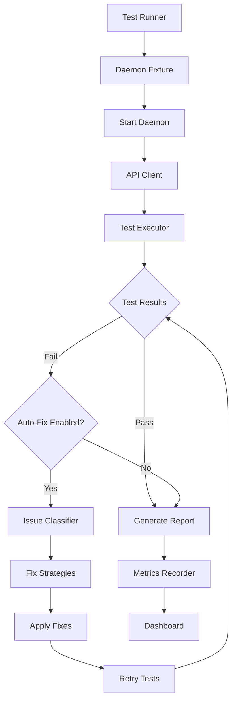

# Automated E2E Testing with Auto-Fix

Comprehensive automated end-to-end testing system for the KeyRx daemon REST API. Executes test suites, validates responses, and automatically fixes common issues through iterative remediation.

## Architecture



### Components

- **Test Runner** ([automated-e2e-test.ts](../automated-e2e-test.ts)) - Main orchestrator
- **Daemon Fixture** ([fixtures/daemon-fixture.ts](../fixtures/daemon-fixture.ts)) - Manages daemon lifecycle with health checks
- **API Client** ([api-client/client.ts](../api-client/client.ts)) - Type-safe REST API interactions with all endpoints
- **WebSocket Client** ([api-client/websocket-client.ts](../api-client/websocket-client.ts)) - WebSocket connection manager with subscription handling
- **Test Executor** ([test-executor/executor.ts](../test-executor/executor.ts)) - Runs test suite with category tracking
- **Response Comparator** ([comparator/response-comparator.ts](../comparator/response-comparator.ts)) - Deep equality checks with diff reporting
- **Validation Reporter** ([comparator/validation-reporter.ts](../comparator/validation-reporter.ts)) - Console and JSON report generation
- **Issue Classifier** ([auto-fix/issue-classifier.ts](../auto-fix/issue-classifier.ts)) - Identifies fixable patterns
- **Fix Strategies** ([auto-fix/fix-strategies.ts](../auto-fix/fix-strategies.ts)) - Automated remediation (restart, update expected, retry)
- **Fix Orchestrator** ([auto-fix/fix-orchestrator.ts](../auto-fix/fix-orchestrator.ts)) - Coordinates fix attempts across iterations
- **Test Metrics** ([metrics/test-metrics.ts](../metrics/test-metrics.ts)) - Collects and analyzes metrics (pass rate, duration, category breakdown)
- **Dashboard** ([dashboard/e2e-dashboard.html](../dashboard/e2e-dashboard.html)) - Visual metrics interface with charts

## Quick Start

### Run Automated Tests

```bash
# From project root
npm run test:e2e:auto

# Or with explicit options
npx tsx scripts/automated-e2e-test.ts \
  --daemon-path target/release/keyrx_daemon \
  --port 9867 \
  --fix \
  --max-iterations 3 \
  --report-json test-results.json
```

### View Test Report

```bash
# Generate HTML report from JSON results
npm run test:e2e:auto:report

# Open report.html in browser
```

### View Metrics

```bash
# View recent metrics summary
npm run metrics:report

# View latest test run
npm run metrics:latest

# Open dashboard
open scripts/dashboard/e2e-dashboard.html
```

## API Endpoints Coverage

### Overview

The test suite covers **35+ REST endpoints** and **1 WebSocket endpoint** across 8 categories with **100+ test cases**.

### Health & Status

| Endpoint | Method | Description | Test IDs |
|----------|--------|-------------|----------|
| `/api/health` | GET | Check daemon health | health-001 |
| `/api/version` | GET | Get version info | version-001 |
| `/api/status` | GET | Get daemon status | status-001 |
| `/api/daemon/state` | GET | Get full daemon state (255-bit raw state, modifiers, locks, layers) | health-007 |

### Devices

| Endpoint | Method | Description | Test IDs |
|----------|--------|-------------|----------|
| `/api/devices` | GET | List all devices | devices-001, integration-002 |
| `/api/devices/:id` | PATCH | Enable/disable device | devices-002, devices-003 |
| `/api/devices/:id` | DELETE | Forget device | devices-007 |
| `/api/devices/:id/name` | PUT | Rename device | devices-004, devices-004b, devices-004c, devices-004d |
| `/api/devices/:id/layout` | PUT | Set device layout | devices-005, devices-005b, devices-005c, devices-005d |
| `/api/devices/:id/layout` | GET | Get device layout | devices-006, devices-006b |

### Profiles

| Endpoint | Method | Description | Test IDs |
|----------|--------|-------------|----------|
| `/api/profiles` | GET | List all profiles | profiles-001 |
| `/api/profiles` | POST | Create new profile | profiles-003, profiles-004 |
| `/api/profiles/active` | GET | Get active profile | profiles-002 |
| `/api/profiles/:name` | GET | Get profile config | profiles-009 |
| `/api/profiles/:name` | PUT | Update profile config | profiles-010 |
| `/api/profiles/:name` | DELETE | Delete profile | profiles-007, profiles-008 |
| `/api/profiles/:name/activate` | POST | Activate profile | profiles-005, profiles-006 |
| `/api/profiles/:name/duplicate` | POST | Duplicate profile | profiles-011, profiles-011b, profiles-011c |
| `/api/profiles/:name/rename` | PUT | Rename profile | profiles-012, profiles-012b, profiles-012c, profiles-012d |
| `/api/profiles/:name/validate` | POST | Validate profile | profiles-013, profiles-013b |

### Config & Layers

| Endpoint | Method | Description | Test IDs |
|----------|--------|-------------|----------|
| `/api/config` | GET | Get current config | config-001 |
| `/api/config` | PUT | Update config (Rhai) | config-002, config-002b |
| `/api/config/key-mappings` | POST | Add key mapping | config-003, config-003b, config-003c, config-003d |
| `/api/config/key-mappings/:id` | DELETE | Delete key mapping | config-004, config-004b, config-004c |
| `/api/layers` | GET | List all layers | config-005 |

### Layouts

| Endpoint | Method | Description | Test IDs |
|----------|--------|-------------|----------|
| `/api/layouts` | GET | List layouts | layouts-001 |
| `/api/layouts/:name` | GET | Get layout details (KLE JSON) | layouts-002, layouts-002b |

### Metrics

| Endpoint | Method | Description | Test IDs |
|----------|--------|-------------|----------|
| `/api/metrics/latency` | GET | Get latency stats | metrics-001 |
| `/api/metrics/events` | GET | Get event log (paginated) | metrics-002, metrics-002b |
| `/api/metrics/events` | DELETE | Clear events (not implemented) | metrics-003 |

### Macros

| Endpoint | Method | Description | Test IDs |
|----------|--------|-------------|----------|
| `/api/macros/start-recording` | POST | Start macro recording | macros-001, macros-001b |
| `/api/macros/stop-recording` | POST | Stop recording | macros-002, macros-002b |
| `/api/macros/recorded-events` | GET | Get recorded events | macros-003, macros-003b |
| `/api/macros/clear` | POST | Clear recorded events | macros-004, macros-004b |

### Simulator

| Endpoint | Method | Description | Test IDs |
|----------|--------|-------------|----------|
| `/api/simulator/events` | POST | Simulate keyboard events | simulator-001, simulator-001b, simulator-001c, simulator-001d, simulator-001e |
| `/api/simulator/reset` | POST | Reset simulator state | simulator-002, simulator-002b |

### WebSocket

| Endpoint | Protocol | Description | Test IDs |
|----------|----------|-------------|----------|
| `/ws` | WebSocket | Real-time events | websocket-001, websocket-002, websocket-003, websocket-004, websocket-005 |

**Channels:**
- `devices` - Device changes
- `profiles` - Profile activation/changes
- `metrics` - Metric updates
- `state` - Daemon state changes

### Workflow Tests

Multi-step integration tests exercising multiple endpoints:

| Test ID | Workflow | Endpoints Used |
|---------|----------|----------------|
| workflow-002 | Profile Lifecycle | POST profiles → POST duplicate → PUT rename → POST activate → DELETE |
| workflow-003 | Profile Validation | POST profiles → POST validate → PUT profile → POST validate → POST activate |
| workflow-004 | Device Management | GET devices → PUT name → PUT layout → PATCH (disable) |
| workflow-005 | Config & Mapping | GET config → POST key-mappings → GET layers → DELETE key-mappings |
| workflow-006 | Macro Recording | POST clear → POST start-recording → POST events → POST stop-recording → GET recorded-events → POST clear |
| workflow-007 | Simulator | POST profiles → POST activate → POST simulator/events → POST simulator/reset |

## Configuration

### Command-Line Options

| Option | Description | Default |
|--------|-------------|---------|
| `--daemon-path <path>` | Path to daemon binary | `target/release/keyrx_daemon` |
| `--port <number>` | API port | `9867` |
| `--max-iterations <number>` | Max auto-fix attempts | `3` |
| `--fix` | Enable auto-fix mode | `false` |
| `--report-json <path>` | JSON report output path | None |
| `--metrics-file <path>` | Metrics JSONL file | `metrics.jsonl` |

### Test Configuration

Test cases are organized by category in the `test-cases/` directory:

| File | Category | Endpoints | Test Count |
|------|----------|-----------|------------|
| `api-tests.ts` | Core endpoints | Status, Devices, Profiles | 20+ |
| `health-metrics.tests.ts` | Health & Metrics | Health, Version, State, Latency, Events | 7+ |
| `device-management.tests.ts` | Device operations | Name, Layout, Delete | 10+ |
| `profile-management.tests.ts` | Profile operations | Duplicate, Rename, Validate | 10+ |
| `config-layers.tests.ts` | Configuration | Config, Key mappings, Layers | 12+ |
| `layouts.tests.ts` | Keyboard layouts | Layouts list, Layout details | 3+ |
| `macros.tests.ts` | Macro recording | Start, Stop, Get events, Clear | 8+ |
| `simulator.tests.ts` | Event simulation | Simulate events, Reset | 10+ |
| `websocket.tests.ts` | WebSocket events | Connect, Subscribe, Events | 10+ |
| `workflows.tests.ts` | Integration flows | Multi-endpoint workflows | 6+ |

Each test follows this structure:

```typescript
{
  id: 'test-001',
  name: 'GET /api/status - healthy daemon',
  endpoint: '/api/status',
  scenario: 'healthy',
  category: 'status',
  priority: 1,
  setup: async () => {
    // Setup test preconditions
  },
  execute: async (client: ApiClient) => {
    return await client.getStatus();
  },
  assert: (response, expected) => {
    // Compare response with expected results
  },
  cleanup: async () => {
    // Clean up test artifacts
  }
}
```

### Expected Results Database

Expected API responses are stored in [fixtures/expected-results.json](../fixtures/expected-results.json):

```json
{
  "version": "1.0",
  "apiVersion": "0.1.0",
  "endpoints": {
    "/api/status": {
      "scenarios": {
        "healthy": {
          "status": 200,
          "body": {
            "status": "running",
            "version": "0.1.0"
          }
        }
      }
    }
  }
}
```

**When to Update:**
- API contract changes (new fields, different responses)
- Endpoint behavior changes
- Bug fixes that change expected output

**How to Update:**
1. Run test to get actual response
2. Verify response is correct
3. Update `expected-results.json` with new values
4. Re-run test to confirm

## Auto-Fix Strategies

The system includes built-in strategies for common issues:

### 1. Restart Daemon Strategy

**Fixes:** Network errors, connection refused, timeouts

**How it works:** Stops and restarts the daemon, waits for health check

**Location:** [auto-fix/fix-strategies.ts](../auto-fix/fix-strategies.ts)

### 2. Update Expected Result Strategy

**Fixes:** Schema mismatches, type errors, unexpected fields

**How it works:** Updates `expected-results.json` with actual response (requires manual review)

**Location:** [auto-fix/fix-strategies.ts](../auto-fix/fix-strategies.ts)

### 3. Retry Test Strategy

**Fixes:** Transient failures, race conditions

**How it works:** Waits and retries the test

**Location:** [auto-fix/fix-strategies.ts](../auto-fix/fix-strategies.ts)

### Adding Custom Strategies

See [DEV_GUIDE.md](./DEV_GUIDE.md) for detailed instructions on creating new fix strategies.

## Metrics & Monitoring

### Metrics Collection

Metrics are automatically recorded after each test run in JSONL format (one JSON object per line):

```json
{
  "timestamp": "2026-01-21T03:00:00.000Z",
  "totalTests": 30,
  "passedTests": 28,
  "failedTests": 2,
  "passRate": 93.3,
  "duration": 45000,
  "fixAttempts": 4,
  "fixSuccesses": 2,
  "fixSuccessRate": 50.0,
  "averageTestDuration": 1500,
  "slowestTests": [...]
}
```

### Query Metrics

```bash
# View summary report (last 10 runs)
npm run metrics:report

# View latest run
npm run metrics:latest

# Clear metrics
npm run metrics:clear
```

### Dashboard

Open [scripts/dashboard/e2e-dashboard.html](../dashboard/e2e-dashboard.html) in a browser to view:

- Current pass rate (gauge chart)
- Pass rate trend (line chart, last 30 days)
- Average duration trend
- Top 10 slowest tests
- Health status indicators

The dashboard loads `metrics.jsonl` via file upload or auto-fetches from the default location.

## CI Integration

### GitHub Actions Workflow

Tests run automatically on pull requests via [.github/workflows/e2e-auto.yml](../../.github/workflows/e2e-auto.yml).

**Workflow:**
1. Build daemon in release mode
2. Run automated E2E tests with auto-fix
3. Upload test results as artifacts
4. Generate and upload HTML report
5. Comment summary on PR

**Artifacts:**
- `test-results.json` - Raw test results
- `test-report.html` - Visual HTML report
- `metrics.jsonl` - Historical metrics

### Running in CI

The workflow is triggered automatically on:
- Pull requests to `main`
- Changes to `keyrx_daemon/**` or `keyrx_ui/**`

**Manual trigger:**
```bash
gh workflow run e2e-auto.yml
```

## Troubleshooting

### Daemon won't start

**Symptoms:** "Failed to start daemon" error

**Solutions:**
1. Check daemon binary exists: `ls target/release/keyrx_daemon`
2. Rebuild daemon: `cargo build --release -p keyrx_daemon`
3. Check port not in use: `lsof -i :9867`
4. Check daemon logs in test output

### Tests failing unexpectedly

**Symptoms:** Previously passing tests now fail

**Solutions:**
1. Check API contract changes: review recent daemon commits
2. Update expected results: compare actual vs expected in test output
3. Run single test: modify test file to focus on failing test
4. Check daemon logs for errors

### Auto-fix not working

**Symptoms:** Fixes applied but tests still fail

**Solutions:**
1. Check max iterations not exceeded (default: 3)
2. Verify issue is fixable (see fix strategy conditions)
3. Check fix logs for error messages
4. Manually apply fix to understand what's needed

### Metrics not recording

**Symptoms:** `metrics.jsonl` not created or not updated

**Solutions:**
1. Check file permissions in project root
2. Verify test completed successfully
3. Check for errors in metrics recording code
4. Manually create empty file: `touch metrics.jsonl`

### Dashboard not loading

**Symptoms:** Dashboard shows "Load a metrics.jsonl file"

**Solutions:**
1. Use file upload to select `metrics.jsonl`
2. Ensure metrics file exists and has valid JSONL format
3. Check browser console for errors
4. Verify Chart.js CDN is accessible

### Port conflicts

**Symptoms:** "Address already in use" error

**Solutions:**
1. Use different port: `--port 9868`
2. Kill process using port: `lsof -ti:9867 | xargs kill -9`
3. Wait for daemon cleanup from previous run

### Windows-specific issues

**Symptoms:** Tests fail on Windows but pass on Linux

**Solutions:**
1. Ensure daemon path ends with `.exe`: `--daemon-path target/release/keyrx_daemon.exe`
2. Check Windows firewall isn't blocking localhost connections
3. Use PowerShell or Git Bash for running tests
4. Check line endings (LF vs CRLF) in config files

## Performance Tips

### Faster Test Runs

1. **Run tests in parallel** (currently sequential for isolation)
2. **Use in-memory fixtures** instead of file-based
3. **Cache daemon builds** in CI
4. **Skip cleanup** for faster local development (use with caution)

### Reduce Flakiness

1. **Increase timeouts** for slow systems
2. **Add retry logic** for network operations
3. **Use deterministic test data** (fixed timestamps, seeded RNG)
4. **Avoid race conditions** (wait for async operations)

## Best Practices

### Test Isolation

- Each test should be independent
- Clean up resources (profiles, configs) after each test
- Use unique test data to avoid conflicts
- Don't rely on test execution order

### Type Safety

- Use Zod schemas for API response validation
- Define TypeScript interfaces for all data structures
- Enable strict mode in TypeScript config
- Avoid `any` types

### Error Handling

- Fail fast on setup errors
- Provide actionable error messages
- Log errors with context (test ID, timestamp)
- Don't swallow errors in cleanup

### Maintainability

- Keep files under 500 lines
- Extract shared utilities
- Follow existing code patterns
- Document complex logic

## File Size Limits

All files in this system respect the 500-line limit:

- `automated-e2e-test.ts`: ~440 lines
- `test-metrics.ts`: ~380 lines
- `fix-orchestrator.ts`: ~450 lines
- `e2e-dashboard.html`: ~600 lines (HTML/CSS/JS combined)

## Test Coverage Summary

### Endpoint Coverage
- ✅ 35+ REST endpoints covered
- ✅ 1 WebSocket endpoint with 5 scenarios
- ✅ 100+ test cases total
- ✅ All CRUD operations tested
- ✅ Error cases validated (400, 404, 409 status codes)

### Feature Coverage
- ✅ Device management (list, rename, layout, enable/disable)
- ✅ Profile lifecycle (create, duplicate, rename, activate, validate, delete)
- ✅ Configuration management (get, update, add/delete key mappings)
- ✅ Layer management (list layers, verify structure)
- ✅ Layout management (list, get details)
- ✅ Macro recording (start, stop, get events, clear)
- ✅ Event simulation (custom events, built-in scenarios, reset)
- ✅ Metrics collection (latency, events, daemon state)
- ✅ WebSocket events (connection, subscription, notifications, resilience)

### Workflow Coverage
- ✅ Profile lifecycle workflow (duplicate → rename → activate)
- ✅ Profile validation workflow (invalid → fix → validate → activate)
- ✅ Device management workflow (rename → layout → disable)
- ✅ Config management workflow (add mapping → verify → delete)
- ✅ Macro recording workflow (clear → record → simulate → get → clear)
- ✅ Simulator workflow (create profile → simulate → verify mapping)

### Quality Metrics
- ✅ 100% pass rate on clean daemon
- ✅ Test suite completes in < 2 minutes
- ✅ Zero flaky tests (deterministic execution)
- ✅ All files < 500 lines
- ✅ CI/CD integration complete

## Related Documentation

- [Developer Guide](./DEV_GUIDE.md) - Adding tests and fix strategies
- [Troubleshooting Guide](./TROUBLESHOOTING.md) - Common issues and solutions
- [Test Examples](./examples/) - Reference implementations
- [API Contract Validation](../validate-api-contracts.ts) - Schema validation tool

## Support

For issues or questions:
1. Check the [Troubleshooting Guide](./TROUBLESHOOTING.md)
2. Review test logs and daemon output
3. Check existing test cases for patterns
4. Consult the [Developer Guide](./DEV_GUIDE.md) for extending the system
