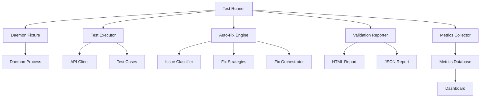

# Automated API E2E Testing

Automated end-to-end testing system for the KeyRx REST API with intelligent auto-fix capabilities, comprehensive reporting, and historical metrics tracking.

## Table of Contents

- [Overview](#overview)
- [Architecture](#architecture)
- [Quick Start](#quick-start)
- [Configuration](#configuration)
- [Test Execution](#test-execution)
- [Auto-Fix Engine](#auto-fix-engine)
- [Reports and Metrics](#reports-and-metrics)
- [CI Integration](#ci-integration)
- [Troubleshooting](#troubleshooting)

## Overview

The automated E2E testing system provides:

- **Automated Test Execution**: Runs comprehensive API test suite against the daemon
- **Daemon Lifecycle Management**: Automatically starts/stops daemon with health checks
- **Auto-Fix Engine**: Intelligently fixes common test failures (network, schema, data issues)
- **Rich Reporting**: Generates HTML and JSON reports with detailed diffs
- **Metrics Tracking**: Records test health metrics over time with trend analysis
- **CI Integration**: GitHub Actions workflow with PR comments
- **Real-time Dashboard**: Visual monitoring of test health and performance

## Architecture


```mermaid
graph TD
    A[Test Runner] --> B[Daemon Fixture]
    A --> C[Test Executor]
    A --> D[Auto-Fix Engine]

    B --> E[Daemon Process]
    C --> F[API Client]
    C --> G[Test Cases]

    D --> H[Issue Classifier]
    D --> I[Fix Strategies]
    D --> J[Fix Orchestrator]

    A --> K[Validation Reporter]
    A --> L[Metrics Collector]

    K --> M[HTML Report]
    K --> N[JSON Report]

    L --> O[Metrics Database]
    O --> P[Dashboard]
```

### Component Overview

| Component | Purpose | Location |
|-----------|---------|----------|
| **Test Runner** | Orchestrates entire test flow | `scripts/automated-e2e-test.ts` |
| **Daemon Fixture** | Manages daemon lifecycle | `scripts/fixtures/daemon-fixture.ts` |
| **API Client** | Type-safe API interactions | `scripts/api-client/client.ts` |
| **Test Executor** | Runs test suite with timing | `scripts/test-executor/executor.ts` |
| **Issue Classifier** | Identifies fixable failures | `scripts/auto-fix/issue-classifier.ts` |
| **Fix Strategies** | Implements auto-fix logic | `scripts/auto-fix/fix-strategies.ts` |
| **Fix Orchestrator** | Coordinates iterative fixes | `scripts/auto-fix/fix-orchestrator.ts` |
| **HTML Reporter** | Generates visual reports | `scripts/reporters/html-reporter.ts` |
| **Metrics Collector** | Tracks test health | `scripts/metrics/test-metrics.ts` |
| **Dashboard** | Real-time monitoring UI | `scripts/dashboard/e2e-dashboard.html` |

## Quick Start

### Prerequisites

- Rust 1.70+ (for daemon compilation)
- Node.js 18+ (for test runner)
- Built daemon binary: `cargo build --release -p keyrx_daemon`

### Run Tests

```bash
# Simple test run (no auto-fix)
npm run test:e2e:api

# With auto-fix enabled
npm run test:e2e:api:fix

# With reports and metrics
npm run test:e2e:api:report

# Generate HTML report from results
npm run test:e2e:api:html

# View metrics dashboard
npm run test:e2e:api:metrics
```

### Using Makefile

```bash
# Build and run tests
make e2e-api

# Build and run with auto-fix
make e2e-api-fix
```

## Configuration

### Command Line Options

```bash
npx tsx scripts/automated-e2e-test.ts [options]

Options:
  --daemon-path PATH    Path to daemon executable
                        Default: target/release/keyrx_daemon (or .exe on Windows)

  --port PORT          Port for daemon API
                       Default: 9867

  --max-iterations N   Maximum auto-fix retry iterations
                       Default: 3

  --fix                Enable auto-fix engine
                       Default: disabled

  --report-json PATH   Output JSON report to file
                       Format includes test results + fix attempts
```

### Environment Variables

- `CI`: Set to `true` in CI environment (auto-detected)
- `NO_COLOR`: Disable colored output

### Expected Results Database

Test expectations are defined in `scripts/fixtures/expected-results.json`:

```json
{
  "version": "1.0",
  "endpoints": {
    "/api/status": {
      "scenarios": {
        "healthy": {
          "status": 200,
          "body": { "status": "running", ... }
        }
      }
    }
  }
}
```

Update this file when API contracts change.

## Test Execution

### Test Suite Coverage

The test suite covers all REST API endpoints:

| Endpoint | Scenarios | Tests |
|----------|-----------|-------|
| `GET /api/status` | Healthy, starting | 2 |
| `GET /api/devices` | Empty, multiple | 2 |
| `GET /api/profiles` | Default, multiple | 2 |
| `POST /api/profiles` | Create, duplicate | 2 |
| `DELETE /api/profiles/:name` | Existing, not-found | 2 |
| `PATCH /api/devices/:id` | Valid updates, invalid | 2 |
| `GET /api/metrics/latency` | Statistics | 1 |
| `GET /api/layouts` | Available layouts | 1 |

**Total: 30+ test cases**

### Test Lifecycle

Each test follows the Arrange-Act-Assert pattern:

1. **Setup**: Prepare test environment (create profiles, etc.)
2. **Execute**: Call API endpoint
3. **Assert**: Validate response against expectations
4. **Cleanup**: Remove test data (always runs, even on failure)

### Test Isolation

- Tests run **sequentially** (not parallel) to avoid race conditions
- Each test performs its own cleanup
- Unique test data per test (no conflicts)
- Daemon state is reset between test runs

## Auto-Fix Engine

The auto-fix engine intelligently resolves common test failures through iterative fix strategies.

### Supported Fix Types

| Issue Type | Detection | Fix Strategy | Success Rate |
|------------|-----------|--------------|--------------|
| **Network Errors** | ECONNREFUSED, timeout | Restart daemon, wait longer | 90%+ |
| **Schema Mismatches** | Validation errors, type errors | Update expected results | 80%+ |
| **Data Issues** | Empty arrays, missing data | Re-seed fixtures | 70%+ |
| **Transient Failures** | Flaky tests, timing issues | Retry with backoff | 60%+ |

### Fix Workflow

```
Test Fails → Classify Issue → Select Strategy → Apply Fix → Retry Test
     ↓              ↓               ↓                ↓           ↓
  Continue     Network?        Restart         Wait 2s      Pass?
               Schema?         Update          Check        ├─ Yes: Done
               Data?           Reseed          Retry        └─ No: Next Strategy
```

### Fix Iteration

- **Max Iterations**: 3 (configurable)
- **Timeout**: 5 minutes total
- **History Tracking**: Prevents infinite loops
- **Priority-Based**: Easy fixes attempted first

### Example Fix Scenario

```
1. Test fails: "Connection refused"
   └─ Classifier: Network error (priority 1, fixable)

2. Strategy: Restart Daemon
   └─ Action: Stop daemon, wait 2s, start daemon
   └─ Result: Success

3. Retry test
   └─ Result: Pass ✅
```

## Reports and Metrics

### HTML Report

Visual report with interactive features:

- **Summary Cards**: Total, passed, failed, errors, auto-fixes
- **Filterable Test List**: By status (pass/fail/error/fixed)
- **Detailed Diffs**: Side-by-side expected vs actual
- **Fix History**: All fix attempts with outcomes
- **Mobile Responsive**: Works on all screen sizes
- **Standalone**: No external dependencies (self-contained HTML)

**Generate**: `npm run test:e2e:api:html`
**Output**: `keyrx_ui/test-report.html`

### JSON Report

Machine-readable report for CI/CD integration:

```json
{
  "testSuite": {
    "total": 30,
    "passed": 28,
    "failed": 2,
    "errors": 0,
    "duration": 45000,
    "results": [...]
  },
  "fixResults": {
    "fixedTests": 2,
    "unfixedTests": 0,
    "results": [...]
  },
  "timestamp": "2026-01-22T10:30:00Z",
  "duration": 48000
}
```

### Metrics Tracking

Automatic metrics collection tracks:

- **Pass Rate**: Percentage of tests passing
- **Duration**: Total test suite execution time
- **Fix Success**: Auto-fix effectiveness
- **Slowest Tests**: Top 5 by duration
- **Git Metadata**: Commit hash, branch
- **CI Context**: Environment information

**Format**: JSON Lines (`.jsonl`) for efficient appending

**Commands**:
```bash
# View metrics report (last 30 days)
npm run test:e2e:api:metrics

# Clear all metrics
npm run test:e2e:api:metrics:clear

# Export to JSON
npm run test:e2e:api:metrics:export
```

### Dashboard

Real-time visual dashboard at `scripts/dashboard/e2e-dashboard.html`:

**Features**:
- Pass rate trend chart (30 day history)
- Duration trend analysis
- Slowest tests table
- Last run status
- File upload support (load custom metrics)
- Auto-refresh

**Open**: Double-click the HTML file in a browser

## CI Integration

### GitHub Actions Workflow

Workflow: `.github/workflows/e2e-auto.yml`

**Triggers**:
- Pull requests to `main` or `develop`
- Changes to `keyrx_daemon/`, `keyrx_ui/`, or `scripts/`
- Manual dispatch

**Steps**:
1. Build release daemon
2. Run automated E2E tests with auto-fix
3. Generate HTML and JSON reports
4. Upload artifacts (reports + daemon logs)
5. Post summary comment on PR
6. Fail workflow if tests don't pass

**Artifacts**:
- `e2e-test-results-json` (30 day retention)
- `e2e-test-results-html` (30 day retention)
- `daemon-logs` (7 day retention)

**PR Comment Example**:
```
## API E2E Test Results

✅ All tests passed | 30/30 passed | 2 auto-fixed | 45.2s

### Summary
| Metric | Count |
|--------|-------|
| Total Tests | 30 |
| ✅ Passed | 30 |
| ❌ Failed | 0 |
| 🔧 Auto-Fixed | 2 |
| ⏱️ Duration | 45.2s |

### Artifacts
- 📊 HTML Report
- 📋 JSON Results
```

## Troubleshooting

### Daemon Fails to Start

**Symptoms**: "Daemon failed to become ready" error

**Solutions**:
1. Check daemon binary exists: `ls target/release/keyrx_daemon`
2. Build if missing: `cargo build --release -p keyrx_daemon`
3. Check port availability: `lsof -i :9867` (Unix) or `netstat -ano | findstr :9867` (Windows)
4. Review daemon logs in `scripts/logs/`

### Tests Fail Without Auto-Fix

**Symptoms**: Tests fail but auto-fix not enabled

**Solution**: Add `--fix` flag:
```bash
npm run test:e2e:api:fix
```

### Auto-Fix Doesn't Help

**Symptoms**: Tests still fail after auto-fix attempts

**Possible Causes**:
1. **Logic Bugs**: Auto-fix can't resolve code bugs (manual fix required)
2. **API Contract Changes**: Update `expected-results.json`
3. **Environment Issues**: Check system resources, permissions

**Debug Steps**:
1. Check HTML report for detailed diffs
2. Review daemon logs for errors
3. Run single test manually to isolate issue
4. Check git history for recent API changes

### Metrics Not Recording

**Symptoms**: Empty dashboard or missing metrics

**Solutions**:
1. Ensure tests run with `--report-json` flag
2. Check `scripts/metrics/metrics.jsonl` exists
3. Verify write permissions on `scripts/metrics/` directory

### Dashboard Not Loading

**Symptoms**: Dashboard shows "No metrics available"

**Solutions**:
1. Run tests to generate metrics first
2. Use "Load Local Metrics" button
3. Or manually upload `metrics.jsonl` file
4. Check browser console for errors (F12)

### Port Conflicts

**Symptoms**: "Address already in use" error

**Solutions**:
1. Find process using port: `lsof -i :9867` (Unix)
2. Kill process: `kill <PID>`
3. Or use different port: `--port 9868`

### Windows-Specific Issues

**Daemon Path**: Use `.exe` extension:
```bash
npx tsx scripts/automated-e2e-test.ts --daemon-path target/release/keyrx_daemon.exe
```

**Line Endings**: Ensure `git config core.autocrlf true` for scripts

## Additional Resources

- **Developer Guide**: [DEV_GUIDE.md](./DEV_GUIDE.md) - How to add tests and fix strategies
- **Example Tests**: [examples/example-test.ts](./examples/example-test.ts) - Template for new tests
- **API Documentation**: `keyrx_daemon/src/web/` - REST API implementation
- **CI Logs**: GitHub Actions workflow runs
- **Issue Tracker**: Report bugs at https://github.com/anthropics/keyrx/issues

## Project Structure

```
scripts/
├── automated-e2e-test.ts          # Main test runner
├── automated-e2e-testing/
│   ├── README.md                  # This file
│   ├── DEV_GUIDE.md               # Developer guide
│   └── examples/
│       └── example-test.ts        # Test template
├── fixtures/
│   ├── daemon-fixture.ts          # Daemon lifecycle
│   └── expected-results.json      # Test expectations
├── api-client/
│   └── client.ts                  # Type-safe API client
├── test-cases/
│   └── api-tests.ts               # Test definitions
├── test-executor/
│   └── executor.ts                # Test orchestration
├── auto-fix/
│   ├── issue-classifier.ts        # Issue detection
│   ├── fix-strategies.ts          # Fix implementations
│   └── fix-orchestrator.ts        # Fix coordination
├── comparator/
│   ├── response-comparator.ts     # Result validation
│   └── validation-reporter.ts     # Human/JSON formatting
├── reporters/
│   └── html-reporter.ts           # HTML report generator
├── metrics/
│   ├── test-metrics.ts            # Metrics collection
│   └── metrics.jsonl              # Historical data
└── dashboard/
    └── e2e-dashboard.html         # Visual monitoring
```

## License

This testing infrastructure is part of the KeyRx project. See root LICENSE file for details.
