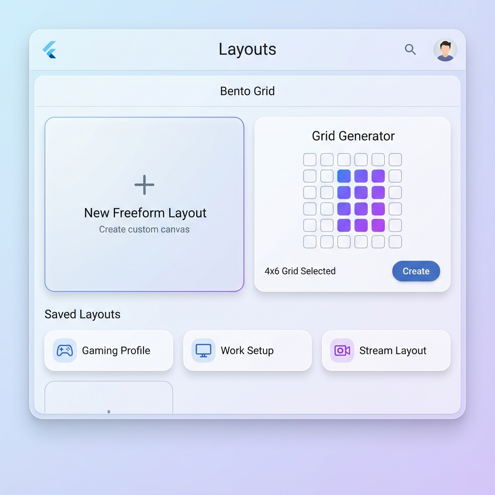
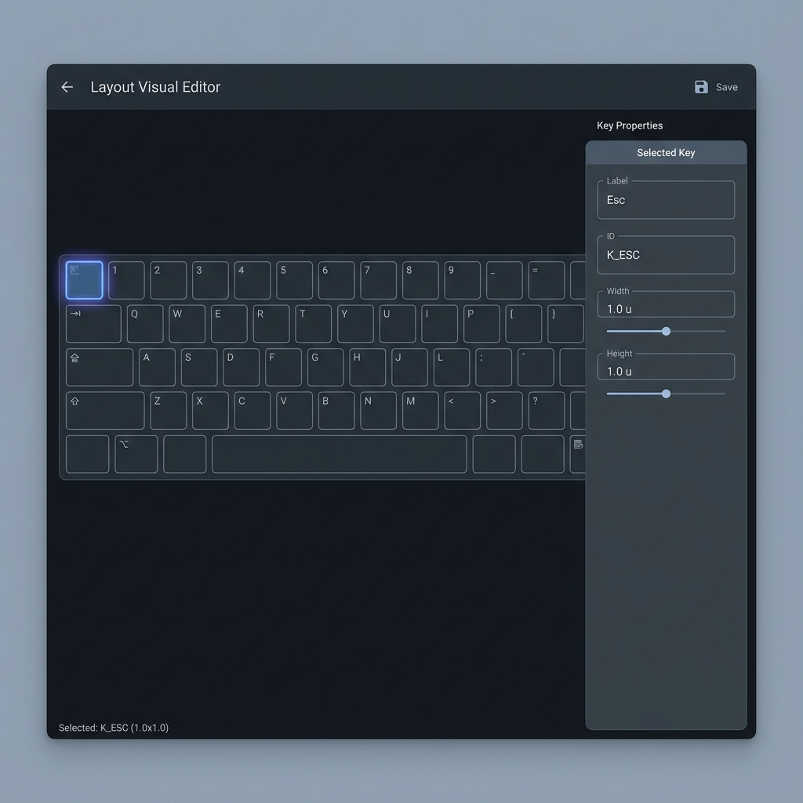

# Layouts Screen Wireframes

## Overview
This document outlines the visual design for the refined Layouts screen in the KeyRx application. The goal is to move from a list-based, manual creation process to a visual, interactive experience.

## 1. Layout Selector (Bento Style)
When the user navigates to the 'Layouts' tab (or when no specific layout is selected), they are presented with a modern "Bento Grid" style selector.

### Elements:
- **New Freeform Layout**: A large, prominent card to start a blank layout.
- **Grid Generator**: A large card featuring an interactive grid picker (hover to select N x M size).
- **Saved Layouts**: Smaller cards representing existing layouts (e.g., 'Gaming Profile', 'Work Setup').

## 2. Layout Visual Editor
Once a layout is created or selected, the view switches to the Visual Editor.

### Elements:
- **Main Area**: A visual representation of the keyboard layout. Keys are rendered as interactive widgets.
- **Selection**: Clicking a key highlights it visually.
- **Property Bar (Sidebar)**: A dedicated panel on the right (or appearing contextually) to edit the properties of the selected key:
    - **Label**: Text field for the key label (e.g., "Esc").
    - **ID**: Text field for the internal ID (e.g., "K_ESC").
    - **Dimensions**: Controls for width and height.
    - **Position**: Controls for X/Y coordinates.

